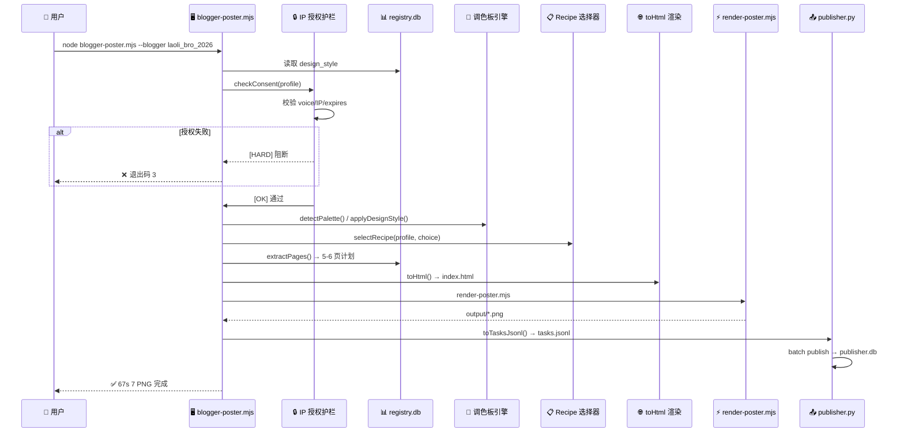
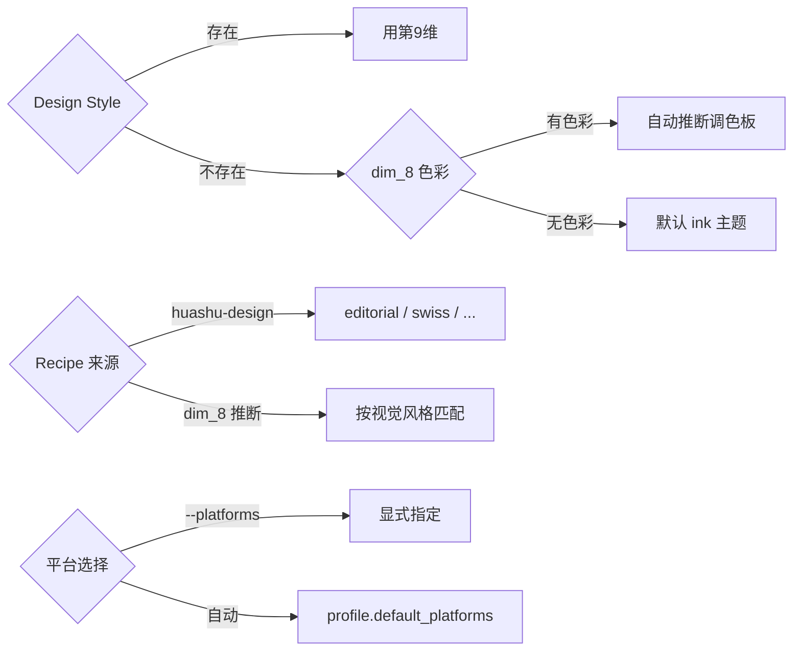
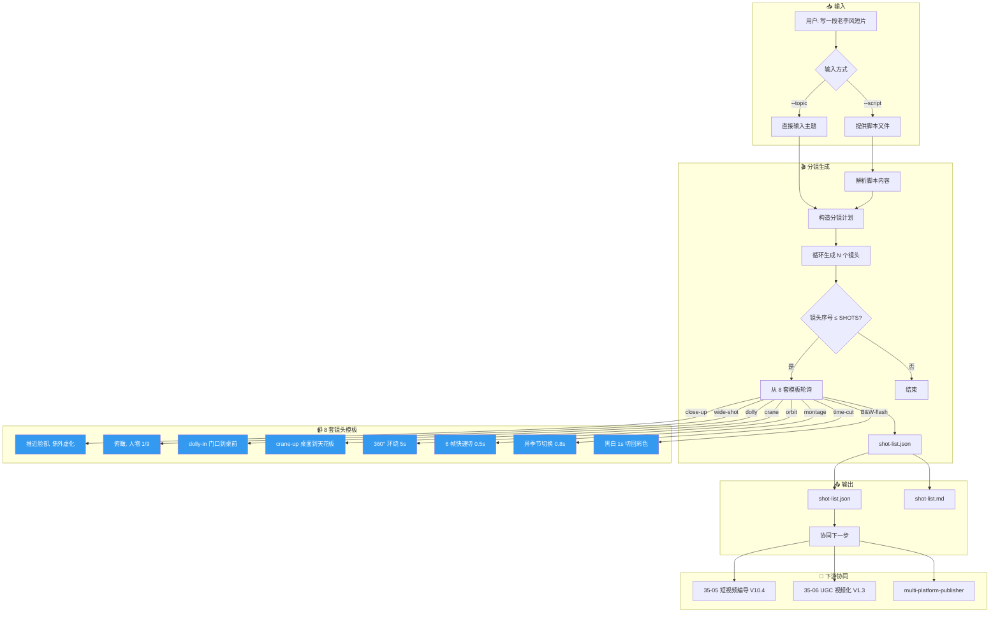
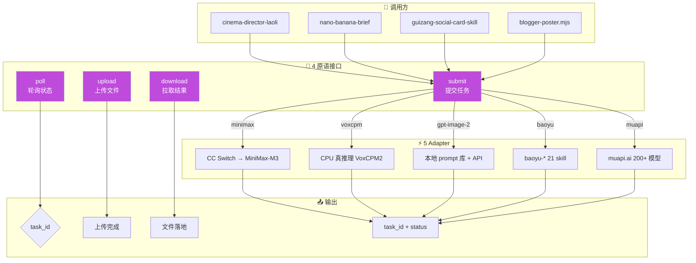
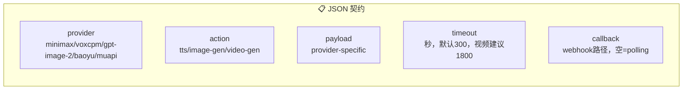
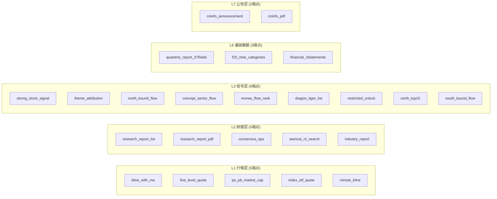
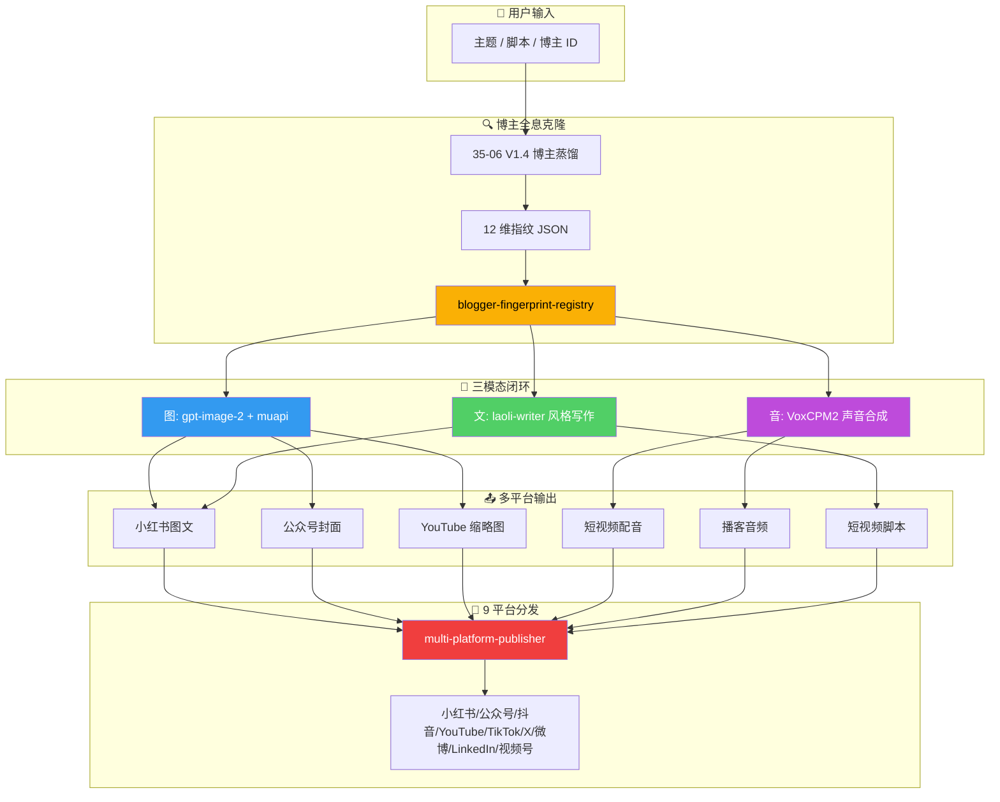

# 天龙引擎核心工作流可视化

> **用途**：展示天龙引擎 4 大核心 pipeline 的完整流程，便于理解资产关系和调用链路
> **版本**：V1.0 · 2026-08-16
> **配套**：[BIBLE.md](../BIBLE.md) · [CLAUDE.md](../CLAUDE.md)

---

## 目录

1. [博主全息出图 Pipeline](#1-博主全息出图-pipeline) - 阶段 19 V2.0
2. [老李风短视频 Pipeline](#2-老李风短视频-pipeline) - 阶段 3
3. [异步任务统一接口](#3-异步任务统一接口) - 阶段 5
4. [财经数据底座 Pipeline](#4-财经数据底座-pipeline) - 阶段 25/26
5. [三模态闭环总览](#5-三模态闭环总览) - 阶段 1

---

## 1. 博主全息出图 Pipeline

> **核心入口**：`skills/guizang-social-card-skill/pipeline/blogger-poster.mjs`
> **能力**：8 维博主全息 JSON → 5-6 张小红书图文 + 公众号封面 PNG → 9 平台分发
> **实测**：67s 7 PNG + publisher 14 success

### 1.1 完整流程图

```mermaid
graph TD
    subgraph 输入["📥 输入层"]
        A[用户命令] --> B{博主来源}
        B -->|IP Profile| C[ip_profile_8dim.json]
        B -->|显式路径| D[--profile /path/to/json]
        B -->|--all| E[遍历 registry.db 所有博主]
    end

    subgraph 授权["🔒 IP 授权三重护栏"]
        C --> F{授权检查}
        F -->|voice_consent| G[声纹授权]
        F -->|ip_image_consent| H[IP 形象授权]
        F -->|expires_at| I[有效期检查]
        G -->|缺失| J[\"[HARD] 阻断生成\"]
        H -->|缺失| J
        I -->|已过期| J
    end

    subgraph 生成["🎨 视觉生成层"]
        J -->|通过| K[调色板选择]
        K -->|第9维设计风格| L[huashu-design 40 风格库]
        K -->|自动推断| M[dim_8_ip_visual 色彩分析]
        L --> N[Palette + Theme]
        M --> N
        N --> O[Recipe 选择]
        O --> P[extractPages: 抽取 5-6 页计划]
    end

    subgraph 渲染["🖼️ 渲染输出层"]
        P --> Q[拼 index.html]
        Q --> R{验证 HTML}
        R -->|通过| S[render-poster.mjs]
        R -->|失败| T[\"[FAIL] 停止\"]
        S --> U[输出 PNG 列表]
    end

    subgraph 发布["🚀 发布层"]
        U --> V[toTasksJsonl: 构造发布任务]
        V --> W{平台选择}
        W -->|小红书| X[xhs]
        W -->|公众号| Y[wechat]
        W -->|视频号| Z[wechannel]
        X --> AA[9 平台分发]
        Y --> AA
        Z --> AA
        AA --> AB[runPublisherBatch]
        AB --> AC[publish_tasks 表]
        AC --> AD[\"[OK] 完成\"]
    end

    style J fill:#ff6b6b,color:#fff
    style T fill:#ff6b6b,color:#fff
    style AD fill:#51cf66,color:#fff
```

### 1.2 核心步骤时序



### 1.3 决策矩阵



---

## 2. 老李风短视频 Pipeline

> **核心入口**：`skills/cinema-director-laoli/scripts/generate.sh`
> **能力**：主题 → 8 套老李风电影分镜 JSON + Markdown
> **协同**：喂给 35-05 短视频编导 + 35-06 UGC 视频化

### 2.1 完整流程图



### 2.2 镜头模板详情

| 模板 | 类型 | 时长 | Prompt 片段 |
|------|------|------|-------------|
| 1 | close-up | 2-5s | 镜头推近脸部，半秒，焦外虚化暖光背景 |
| 2 | wide-shot | 3-6s | 镜头拉远俯瞰，人物小到画面 1/9 |
| 3 | dolly | 3-5s | 从门口 dolly-in 到桌前，3 秒匀速 |
| 4 | crane | 2-4s | 从桌面 crane-up 到天花板，2 秒 |
| 5 | orbit | 5-7s | 镜头围绕人物 360° 旋转 5 秒 |
| 6 | montage | 3s | 快速 6 帧切，每帧 0.5 秒 |
| 7 | time-cut | 5s | 同场景不同季节快速切换，0.8 秒/帧 |
| 8 | B&W-flash | 2s | 突然切到黑白 1 秒，再回彩色 |

---

## 3. 异步任务统一接口

> **核心入口**：`skills/async-task-pattern/`
> **能力**：4 原语（submit/poll/upload/download）统一 5 个 backend
> **验证**：19/19 PASS

### 3.1 整体架构图



### 3.2 JSON 契约 5 必传



### 3.3 退出码语义

| 退出码 | 含义 | 场景 |
|--------|------|------|
| 0 | PASS | 正常完成 |
| 1 | FAIL | 业务失败 |
| 2 | 配置错 | KEY 缺失/格式错误 |
| 3 | 系统错 | 网络/IO 异常 |
| 4 | 未实现 | adapter 不支持此 action |

---

## 4. 财经数据底座 Pipeline

> **核心入口**：`skills/a-stock-data-bridge/em_base.py`
> **能力**：43 个 A 股端点 + 17 个美港股端点 → 个股深度底稿
> **实测**：茅台 24 rows · 北向 66 rows · 公告 16 rows

### 4.1 A 股底稿生成流程

```mermaid
graph TD
    subgraph 输入["📥 输入"]
        A[用户命令] --> B["python em_base.py"]
        B --> C{底稿类型}
        C -->|stock| D[个股深度底稿]
        C -->|valuation| E[估值分析底稿]
        C -->|industry| F[行业底稿]
    end

    subgraph 层级["📊 10 层数据架构"]
        D --> G[L1 行情层<br/>K线/5档/PE-PB]
        D --> H[L2 研报层<br/>研报列表/一致预期]
        D --> I[L3 信号层<br/>北向/龙虎榜/题材]
        D --> J[L4 资金面<br/>融资融券/大宗]
        D --> K[L5 新闻层<br/>个股新闻/全球资讯]
        D --> L[L6 基础数据<br/>季报37字段/财报三表]
        D --> M[L7 公告层<br/>巨潮公告/PDF]
    end

    subgraph 数据源["🌐 数据源路由"]
        G --> N[东方财富 / 同花顺]
        H --> O[慧博 / i问财]
        I --> P[北向公开接口]
        L --> Q[交易所原始]
        M --> R[巨潮网]
    end

    subgraph 输出["📤 输出"]
        S[output.md<br/>markdown 底稿]
        T[em_check.py<br/>5 项质检]
        S --> T
        T -->|W1-W5| U[\"[PASS] 合格\"]
        T -->|FAIL| V[\"[FAIL] 需修正\"]
    end

    style G fill:#20c997,color:#fff
    style H fill:#20c997,color:#fff
    style I fill:#20c997,color:#fff
    style J fill:#20c997,color:#fff
    style K fill:#20c997,color:#fff
    style L fill:#20c997,color:#fff
    style M fill:#20c997,color:#fff
```

### 4.2 43 端点分层矩阵



---

## 5. 三模态闭环总览

> **阶段 1** 核心能力：图 + 音 + 文 三模态工业化生产



---

## 附录：快速索引

| Pipeline | 入口文件 | 主要输出 | 验证状态 |
|----------|----------|----------|----------|
| 博主全息出图 | `blogger-poster.mjs` | 5-6 PNG + tasks.jsonl | 67s 7 PNG ✅ |
| 老李风分镜 | `generate.sh` | shot-list.json/md | 6/6 PASS ✅ |
| 异步任务 | `async-task-pattern/` | task_id + 结果文件 | 19/19 PASS ✅ |
| 财经底座 | `em_base.py` | markdown 底稿 | 茅台 24 rows ✅ |
| 三模态闭环 | BIBLE.md §3 | 图+音+文 | 351 爆款矩阵 ✅ |

---

> **天龙视角**：本图表是天龙引擎 4 大核心 pipeline 的可视化索引。配合 [BIBLE.md](../BIBLE.md) §4 调用协议使用效果更佳。
