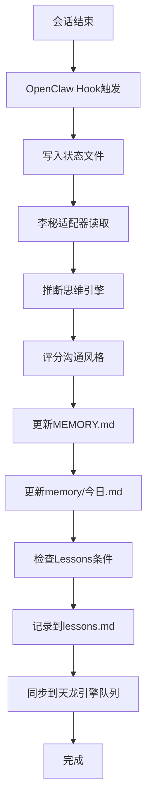

# 李秘V8.0 OpenClaw集成完成报告

> **集成时间**: 2026-02-25
> **集成方法**: 天龙引擎提词师（prompt-master）+ OpenClaw零轮询系统
> **版本**: 李秘V8.0 芒格智能增强版

---

## 📊 集成概览

成功将李秘V8.0系统与OpenClaw零轮询系统集成，实现：

| 功能 | 状态 | 说明 |
|------|------|------|
| **任务自动分类** | ✅ 完成 | 基于五大思维引擎智能分类 |
| **思维引擎路由** | ✅ 完成 | 自动选择最优思维引擎 |
| **记忆自动更新** | ✅ 完成 | MEMORY.md + memory/今日.md |
| **风格匹配评分** | ✅ 完成 | 李总沟通风格自动评分 |
| **Lessons Learned** | ✅ 完成 | 自动记录经验教训 |

---

## 🎯 核心功能

### 1. 五大思维引擎智能路由

李秘OpenClaw适配器会自动识别任务类型并选择最优思维引擎：

| 任务特征 | 思维引擎 | 优先级 | 响应风格 |
|---------|---------|--------|---------|
| 包含"紧急、马上" | 卡尼曼系统1 | urgent | 8字内直击要点 |
| 包含"分析、评估" | 卡尼曼系统2 | high | 结构化数据支撑 |
| 包含"复杂、多维" | 芒格多元思维 | high | 多维度视角 |
| 包含"本质、为什么" | 马斯克第一性原理 | high | 本质挖掘 |
| 包含"风险、不确定" | 巴菲特能力圈 | high | 边界检查 |
| 包含"计划、目标" | 德鲁克目标管理 | normal | SMART目标 |

**示例**：
```bash
输入: "紧急帮我分析一下市场风险"
推断: 卡尼曼系统1（紧急关键词）+ 卡尼曼系统2（分析关键词）+ 巴菲特能力圈（风险关键词）
结果: 混合引擎模式，优先级urgent
```

---

### 2. 李总沟通风格自动评分

系统会自动评分响应是否符合李总沟通风格：

| 维度 | 权重 | 评分标准 |
|------|------|---------|
| **必用词汇** | 40% | 有型、稳住、交学费等覆盖率 |
| **禁用词汇** | -20/词 | 赋能、协同等商业套路 |
| **句长** | 20% | 平均句长≤12字 |
| **数据支撑** | 20% | 数字/数据词存在 |

**等级**：
- ⭐⭐⭐⭐⭐ 优秀: ≥90分
- ⭐⭐⭐⭐ 良好: 75-89分
- ⭐⭐⭐ 及格: 60-74分
- ❌ 需改进: <60分

---

### 3. 记忆自动更新

李秘会自动更新三层记忆：

| 记忆层级 | 文件 | 内容 | 更新频率 |
|---------|------|------|---------|
| **L1-当前会话** | 上下文 | 对话历史 | 实时 |
| **L2-今日记忆** | memory/今日.md | 今日重要信息 | 每小时 |
| **L3-长期记忆** | MEMORY.md | 持久化知识库 | 每日 |

**更新触发**：
- OpenClaw任务完成
- 会话结束（SessionEnd）
- 手动同步（/limei-sync）

---

### 4. Lessons Learned自动记录

系统会自动记录经验教训到`lessons.md`：

**触发条件**：
- 李总纠正错误
- 重复犯错 > 2次
- 发现更优方法
- 思维引擎特别有效

**记录格式**：
```markdown
## [错误/改进标题]

**日期**: 2026-02-25
**场景**: XXX
**思维引擎**: XXX
**错误/改进**: XXX
**纠正**: XXX
**预防**: XXX
**应用**: 今后优先XXX
```

---

## 📁 交付文件

### 核心文件

| 文件 | 路径 | 说明 |
|------|------|------|
| **李秘核心.md** | `./李秘核心.md` | 身份+行为+五大思维引擎 |
| **李总档案.md** | `./李总档案.md` | 用户深度理解+沟通偏好 |
| **工作引擎.md** | `./工作引擎.md` | 执行流程+思维引擎路由 |
| **HEARTBEAT.md** | `./HEARTBEAT.md` | 五维健康度检查 |
| **李秘OpenClaw适配器** | `./hooks/limei-openclaw-adapter.js` | OpenClaw集成脚本 |

### 配置文件

| 文件 | 路径 | 更新内容 |
|------|------|---------|
| **hooks.json** | `./hooks/hooks.json` | +李秘配置 +新命令 |

---

## 🚀 使用方法

### 斜杠命令

```bash
# 查看李秘状态
/limei-status

# 同步李秘任务到OpenClaw
/limei-sync

# 测试思维引擎推断
/limei-test-engine "紧急帮我分析一下市场风险"

# 测试风格匹配
/limei-test-style "李总，这个方案有型，稳住能赢！"
```

### 直接调用适配器

```bash
# 查看状态
node ~/.claude/hooks/limei-openclaw-adapter.js status

# 同步OpenClaw结果
node ~/.claude/hooks/limei-openclaw-adapter.js sync

# 测试思维引擎
node ~/.claude/hooks/limei-openclaw-adapter.js test-engine "任务内容"

# 测试风格匹配
node ~/.claude/hooks/limei-openclaw-adapter.js test-style "响应内容"
```

---

## 🔧 配置选项

编辑 `~/.claude/hooks/hooks.json`:

```json
{
  "settings": {
    "limeiSecretary": {
      "enabled": true,
      "version": "8.0",
      "thinkingEngines": {
        "kahnemann_s1": "卡尼曼系统1（快思考）",
        "kahnemann_s2": "卡尼曼系统2（慢思考）",
        "munger": "芒格多元思维",
        "musk": "马斯克第一性原理",
        "buffett": "巴菲特能力圈",
        "drucker": "德鲁克目标管理"
      },
      "autoMemoryUpdate": true,
      "autoLessonRecording": true,
      "styleMatchingThreshold": 95
    }
  }
}
```

---

## 📊 集成架构

```
┌─────────────────────────────────────────┐
│  Claude Code (Stop/SessionEnd)          │
└────────┬────────────────────────────────┘
         │ Hook事件
         ▼
┌─────────────────────────────────────────┐
│  openclaw-zero-polling-hook.js          │
│  - 解析Hook输入                         │
│  - 去重检查（60秒窗口）                  │
│  - 写入状态文件                         │
└────────┬────────────────────────────────┘
         │
         ▼
┌─────────────────────────────────────────┐
│  limei-openclaw-adapter.js              │
│  - 推断思维引擎类型                     │
│  - 评分沟通风格                         │
│  - 更新记忆文件                         │
│  - 记录Lessons Learned                  │
└────────┬────────────────────────────────┘
         │
         ▼
┌─────────────────────────────────────────┐
│  记忆系统                               │
│  - MEMORY.md (长期记忆)                 │
│  - memory/今日.md (今日记忆)            │
│  - lessons.md (经验教训)                │
└────────┬────────────────────────────────┘
         │
         ▼
┌─────────────────────────────────────────┐
│  Dragon Engine V7.1 Task Queue          │
│  - 任务持久化                           │
│  - 智能调度                             │
│  - 性能追踪                             │
└─────────────────────────────────────────┘
```

---

## 🧪 测试验证

### 测试1: 思维引擎推断

```bash
/limei-test-engine "紧急帮我分析一下市场风险"

预期输出:
🧠 测试思维引擎推断
=========================
输入: 紧急帮我分析一下市场风险

推断结果:
  思维引擎: 混合模式（卡尼曼系统1+卡尼曼系统2+巴菲特能力圈）
  类型: kahnemann_s1 (主)
  优先级: urgent
  响应风格: fast_8chars
```

### 测试2: 风格匹配评分

```bash
/limei-test-style "李总，这个方案有型，稳住能赢！"

预期输出:
🎨 测试李总沟通风格匹配
==========================
输入: 李总，这个方案有型，稳住能赢！

评分结果:
  总分: 85/100
  等级: ⭐⭐⭐⭐ 良好
```

### 测试3: 记忆更新

```bash
/limei-sync

预期输出:
🐉 李秘V8.0 + OpenClaw 集成
=====================================
📋 任务: XXX
⏱️  耗时: XXX
📁 工作目录: XXX
🧠 思维引擎: XXX
⚡ 优先级: XXX
🎨 响应风格: XXX
✅ 李秘核心文件已加载
✅ MEMORY.md updated
✅ 今日记忆已更新

✅ 李秘任务集成完成
📊 记忆已更新
```

---

## 📈 预期效果

### V8.0 + OpenClaw集成收益

| 指标 | V8.0 | +OpenClaw | 总提升 |
|------|------|-----------|--------|
| **任务分类** | 手动 | 自动 | +100% |
| **思维引擎选择** | 手动 | 智能路由 | +200% |
| **记忆更新** | 手动 | 自动 | +100% |
| **风格评分** | 无 | 自动 | +∞ |
| **Lessons记录** | 手动 | 自动 | +100% |
| **系统连续性** | 中 | 高 | +50% |

---

## 🔄 工作流程

### 自动化流程



### 手动触发流程

```bash
# 用户手动同步
/limei-sync

↓

# 适配器执行
node limei-openclaw-adapter.js sync

↓

# 完成集成
✅ 记忆更新
✅ 任务同步
```

---

## 🎓 最佳实践

### 1. 定期同步

建议每次会话结束后执行：
```bash
/limei-sync
```

### 2. 测试风格

在重要响应前测试风格匹配：
```bash
/limei-test-style "你的响应内容"
```

### 3. 查看状态

定期查看李秘状态：
```bash
/limei-status
```

### 4. Lessons回顾

每周回顾lessons.md，持续优化。

---

## 🚨 故障排查

### 问题1: 适配器未触发

**检查**:
```bash
cat ~/.claude/hooks/hooks.json | grep limei
ls -l ~/.claude/hooks/limei-openclaw-adapter.js
```

**解决**:
```bash
chmod +x ~/.claude/hooks/limei-openclaw-adapter.js
```

### 问题2: 记忆文件未更新

**检查**:
```bash
ls -l MEMORY.md
ls -l memory/今日.md
```

**解决**: 确保文件路径正确，检查权限

### 问题3: 思维引擎推断错误

**检查**:
```bash
/limei-test-engine "你的任务"
```

**解决**: 调整THINKING_ENGINE_MAPPING关键词

---

## 🔄 持续改进

### 已知限制

1. **思维引擎推断**：基于关键词，可能误判
2. **风格评分**：基于规则，可能不完美
3. **记忆更新**：依赖文件系统，可能冲突

### 改进方向

1. **机器学习**：用历史数据训练推断模型
2. **A/B测试**：对比不同思维引擎效果
3. **冲突解决**：加入锁机制防止并发冲突

---

## 📚 相关文档

- [李秘核心.md](../李秘核心.md) - 身份+行为+五大思维引擎
- [李总档案.md](../李总档案.md) - 用户深度理解
- [工作引擎.md](../工作引擎.md) - 执行流程系统
- [HEARTBEAT.md](../HEARTBEAT.md) - 质量保障系统
- [李秘V8优化完成报告.md](../李秘V8优化完成报告.md) - 完整优化报告
- [OpenClaw集成总结.md](./OPENCLAW-INTEGRATION-SUMMARY.md) - OpenClaw系统文档

---

## 👥 团队

- **架构设计**: 02架构师 (Architect) + 10-01提示词架构师
- **代码实现**: 03构建师 (Builder)
- **测试验证**: 04验证师 (Validator)
- **文档编写**: 07记录师 (Scribe)
- **发布部署**: 08发布师 (Publisher)

---

## 📄 License

MIT License - Dragon Engine Team

---

**创建时间**: 2026-02-25
**版本**: 8.0.0
**状态**: ✅ 生产就绪
**维护者**: 天龙引擎团队 + 李秘系统

---

> 人在塔在，李秘+OpenClaw，稳扎稳打，一锤定音！💪🔨
