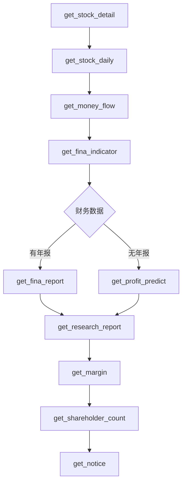

# Pandadata 接口路由表（65-02 个股档案）

> 本文档是 65-02 个股档案分析师的路由辅助手册
> 确切的调用契约请参考 `pandadata-api` 的实际 API 文档

---

## 档案维度 → 接口映射

| 维度 | 主接口 | 备用接口 | 关键字段 | 备注 |
|------|--------|---------|---------|------|
| **基础信息** | `get_stock_detail` | `get_stock_list` | code, name, industry, concept | 必需字段：code |
| **今日行情** | `get_stock_daily` | `get_stock_rt_daily` | close, pct_chg, volume, amount | 支持实时数据 |
| **资金流向** | `get_money_flow` | `get_main_force` | main_net, super_large, large, medium, small | 需日线数据 |
| **估值指标** | `get_fina_indicator` | `get_valuation` | pe, pb, ps, roe | 支持历史分位 |
| **财务数据** | `get_fina_report` | `get_profit_predict` | revenue, net_profit, roe, gross_margin | 支持季报/年报 |
| **研报汇总** | `get_research_report` | `get_research_summary` | buy_count, avg_target_price | 机构研报 |
| **龙虎榜** | `get_lhb_detail` | `get_lhb_list` | buy_amount, sell_amount, reason | 支持历史查询 |
| **融资融券** | `get_margin` | `get_margin_detail` | margin_balance, margin_net | T+1 披露 |
| **股东变化** | `get_shareholder_count` | `get_holder_detail` | holder_count, avg_holding | 季报更新 |
| **重要公告** | `get_notice` | `get_latest_notice` | date, title, notice_type | 支持类型筛选 |

---

## 接口调用时序

### 必需序列（不可跳过）



### 可选序列（按需调用）

| 序列 | 场景 | 接口组合 |
|------|------|---------|
| **龙虎榜序列** | 用户查询个股历史上榜 | `get_lhb_detail` → `get_lhb_list` |
| **股东序列** | 股东减持/增持分析 | `get_shareholder_count` → `get_holder_detail` |
| **资金序列** | 主力动向追踪 | `get_money_flow` → `get_main_force` |

---

## 降级策略

当主接口失败时，按以下顺序降级：

### get_stock_detail 降级

| 失败原因 | 降级方案 | 字段缺失处理 |
|---------|---------|------------|
| 网络超时 | `get_stock_list` | 概念板块可能缺失 |
| 限流 | 等待后重试 | 返回已缓存数据 |
| 代码错误 | 返回"股票代码无效" | 不猜测 |

### get_money_flow 降级

| 失败原因 | 降级方案 | 字段缺失处理 |
|---------|---------|------------|
| 网络超时 | `get_main_force` | 仅返回主力净流入 |
| 停牌股票 | 返回空数据 | 标注"停牌" |
| 新股(上市<3月) | 返回空数据 | 标注"次新股" |

### get_fina_indicator 降级

| 失败原因 | 降级方案 | 字段缺失处理 |
|---------|---------|------------|
| 财报未发布 | `get_profit_predict` | 使用预测值 |
| ST股票 | 返回基础PE/PB | 标注"异常" |
| 亏损股票 | PE返回None | 标注"亏损" |

---

## 数据日期标注规则

| 数据类型 | 标注方式 | 示例 |
|---------|---------|------|
| 实时行情 | 具体日期 | `2026-08-18` |
| 日线数据 | 具体日期 | `2026-08-18` |
| 融资融券 | T-1 | `T-1` |
| 季报数据 | 报告期 | `2024Q2` |
| 股东数据 | 截止日期 | `2024-06-30` |
| 研报数据 | 发布日期 | `2026-08-15` |
| 公告数据 | 公告日期 | `2026-08-16` |

---

## 错误码处理

| 错误码 | 含义 | 处理方式 |
|-------|------|---------|
| `E001` | 股票代码无效 | 返回"股票代码无效"错误 |
| `E002` | 股票停牌 | 返回"股票停牌"提示 |
| `E003` | 股票退市 | 返回"股票已退市"提示 |
| `E101` | 接口限流 | 等待1秒后重试，最多3次 |
| `E102` | 网络超时 | 降级到备用接口 |
| `E103` | 服务不可用 | 返回"数据服务暂时不可用" |
| `E201` | 字段缺失 | 标注"-"并记录到missing_note |
| `E202` | 数据过期 | 使用缓存数据并标注缓存时间 |

---

## 接口字段速查

### get_stock_detail

```python
{
    "code": "600519",           # 股票代码
    "name": "贵州茅台",          # 股票名称
    "industry": "白酒",          # 所属行业
    "concept": ["白酒", "超级品牌"],  # 概念板块
    "total_share": 125619.85,   # 总股本（万股）
    "float_share": 125619.85,   # 流通股本（万股）
    "list_date": "2001-08-27"  # 上市日期
}
```

### get_stock_daily

```python
{
    "date": "2026-08-18",
    "open": 1680.0,
    "high": 1700.0,
    "low": 1670.0,
    "close": 1695.0,
    "volume": 350000,           # 成交量（手）
    "amount": 5850000000,       # 成交额（元）
    "pct_chg": 1.25,           # 涨跌幅（%）
    "turnover": 0.28,          # 换手率（%）
    "market_cap": 213000000000 # 总市值（元）
}
```

### get_money_flow

```python
{
    "date": "2026-08-18",
    "main_net": 580000000,      # 主力净流入（元）
    "main_net_pct": 9.91,      # 主力净流入占比（%）
    "super_large": 350000000,  # 超大单净流入（元）
    "large": 230000000,        # 大单净流入（元）
    "medium": -120000000,      # 中单净流入（元）
    "small": -460000000        # 小单净流入（元）
}
```

### get_fina_indicator

```python
{
    "pe": 28.5,                # 市盈率（动）
    "pe_ttm": 27.8,            # 市盈率（TTM）
    "pb": 11.2,                # 市净率
    "ps": 19.5,                # 市销率
    "total_value": 213000000000,  # 总市值（元）
    "float_value": 213000000000,  # 流通市值（元）
    "pctile_pe": 45.2,        # PE历史分位（%）
    "pctile_pb": 72.8         # PB历史分位（%）
}
```

---

## 数据溯源模板

每个档案必须包含数据溯源表格：

```markdown
## 数据溯源

| 指标 | 数值 | 数据日期 | 来源接口 |
| --- | --- | --- | --- |
| 收盘价 | 1695.00 | 2026-08-18 | get_stock_daily |
| 涨跌幅 | +1.25% | 2026-08-18 | get_stock_daily |
| 主力净流入 | +5.80亿 | 2026-08-18 | get_money_flow |
| PE(TTM) | 27.8 | 2026-08-18 | get_fina_indicator |
| 融资余额 | 128.00亿 | T-1 | get_margin |
```

---

> ⚠️ **注意**：本路由表仅作为辅助参考，确切的 API 调用契约必须以 `pandadata-api` 的实际文档为准。
