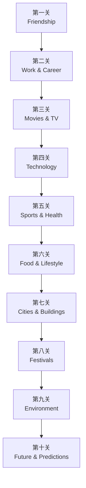

# 新概念英语4知识库（外语教学与研究出版社）

## 教材信息

| 属性 | 内容 |
|------|------|
| 版本 | 外语教学与研究出版社 |
| 册次 | 新概念英语第四册 |
| 目标读者 | 成人英语进阶学习者 |
| 核心能力 | 高级语法、复杂句型、学术阅读、写作表达 |

---

## 📚 单元通关地图



---

## 第一关：Friendship ⭐⭐⭐

### 关卡概览
- **主题**：友谊
- **语法**：形容词作补语、形容词与介词搭配
- **句型**：present perfect现在完成时

### 核心词汇

| 词汇 | 音标 | 词性 | 中文 | 搭配 |
|------|------|------|------|------|
| loyal | /ˈlɔɪəl/ | adj. | 忠诚的 | be loyal to |
| generous | /ˈdʒenərəs/ | adj. | 慷慨的 | be generous with |
| selfish | /ˈselfɪʃ/ | adj. | 自私的 | — |
| trustworthy | /ˈtrʌstˌwɜːrði/ | adj. | 值得信赖的 | — |
| supportive | /səˈpɔːrtɪv/ | adj. | 支持的 | be supportive of |
| devoted | /dɪˈvəʊtɪd/ | adj. | 投入的 | be devoted to |
| considerate | /kənˈsɪdərət/ | adj. | 体贴的 | be considerate of |
| reliable | /rɪˈlaɪəbl/ | adj. | 可靠的 | — |

### 核心语法：形容词作主语补语和宾语补语

```markdown
## 形容词作主语补语（Subject Complement）
主语 + be + 形容词
- He seems tired.（他看起来很累）
- She remained calm.（她保持冷静）

## 形容词作宾语补语（Object Complement）
动词 + 宾语 + 形容词
- I found the book interesting.（我发现这本书有趣）
- The news made everyone happy.（这个消息让每个人开心）
- We consider him generous.（我们认为他很慷慨）

## 常见接宾语补语的动词
find, make, consider, keep, get, turn, prove
```

### 核心语法：形容词与介词搭配

```markdown
## be + 形容词 + 介词
- be good at / bad at（擅长/不擅长）
- be interested in（对...感兴趣）
- be proud of（为...骄傲）
- be similar to（与...相似）
- be different from（与...不同）
- be angry with / about（生...的气）
- be worried about（担心）
- be excited about（对...感到兴奋）
- be surprised at / by（对...惊讶）
- be pleased with（对...满意）
- be disappointed with（对...失望）
- be concerned about / for（关心）
- be keen on（热衷于）
- be fond of（喜欢）
- be tired of（厌倦）
- be aware of（意识到）
- be capable of（能够）
```

### 核心语法：Present Perfect现在完成时

```markdown
## 基本结构
have/has + 过去分词

## 用法
1. 过去发生持续到现在的影响
   I've lost my keys.（我把钥匙弄丢了，现在还没找到）

2. 过去开始持续到现在（常与for/since连用）
   She has lived here for 10 years.
   I've known him since 2015.

3. 近期发生的事（与just, recently, yet, already连用）
   I've just finished my homework.
   Have you finished yet?

4. 经验（与ever, never, once, twice连用）
   Have you ever been to Paris?
   I've never seen such a beautiful sunset.

## 标志词
just / already / yet / still / ever / never / recently / so far / up to now
for + 时间段 / since + 时间点 / this week / today
```

### 费曼讲解：Present Perfect

```
"想象你正在介绍一个朋友：
'这是我大学同学。我们从2018年就认识了，
已经认识8年了。'
这里用现在完成时，是因为：
过去认识的起点 + 一直到现在 = 持续到现在的影响。
说'我们认识'，同时意味着'现在还认识'。
这就是为什么说'We have known each other'，
而不是'We knew each other'。"
```

### 通关考核题

```markdown
1. 用所给词的正确形式填空：
   He seems ______（tire）after the long meeting.
   I found the movie ______（bore）.

2. 选择：
   She has been working here ______ 2015.
   A. for  B. since  C. in  D. at

3. 翻译：
   我们认识彼此已经超过十年了。

4. 改错：
   I have met him last year.（错在哪里？）

5. 用现在完成时写一句话描述你和朋友的友谊。
```

---

## 第二关：Work & Career ⭐⭐⭐

### 关卡概览
- **主题**：工作与职业
- **语法**：间接疑问句、请求与许可
- **句型**：past continuous过去进行时

### 核心词汇

| 词汇 | 音标 | 词性 | 中文 | 搭配 |
|------|------|------|------|------|
| ambitious | /æmˈbɪʃəs/ | adj. | 有雄心的 | be ambitious about |
| competent | /ˈkɒmpɪtənt/ | adj. | 能干的 | be competent in |
| enthusiastic | /ɪnˌθjuːziˈæstɪk/ | adj. | 热情的 | be enthusiastic about |
| responsible | /rɪˈspɒnsəbl/ | adj. | 负责的 | be responsible for |
| efficient | /ɪˈfɪʃənt/ | adj. | 高效的 | — |
| professional | /prəˈfeʃənl/ | adj. | 专业的 | — |
| promote | /prəˈməʊt/ | v. | 晋升/推广 | promote to |
| resign | /rɪˈzaɪn/ | v. | 辞职 | resign from |

### 核心语法：间接疑问句

```markdown
## 直接疑问句 → 间接疑问句
直接问句用问号，间接问句用陈述句语序

## 规则
1. 将疑问词（what, where, when, who, which, how）
   变为连词（if/whether可替代无疑问词的问句）
2. 将助动词do/does/did去掉
3. 将动词时态向后推一个（一般现在→一般过去）
4. 人称相应变化

## 示例
直接：What does he want? → I wonder what he wants.
直接：Where does she live? → Tell me where she lives.
直接：When will they arrive? → Ask when they will arrive.
直接：Did you finish? → Tell me if you finished.

## 时态不变的情况
- 说话时仍在发生
- 时间状语明确
  He asked me when the train leaves.（一般现在表示时刻表）
```

### 核心语法：请求与许可的表达

```markdown
## 请求许可
Could I...?（比Can I更委婉）
Would you mind if I...?（非常正式）
Do you mind if I...?（口语）
Might I...?（非常正式）

## 给予许可
Of course / Sure / Certainly / Go ahead / By all means

## 拒绝许可
I'd rather you didn't. / I'm afraid not. / Sorry, but...

## 典型对话
A: Could I possibly borrow your car?
B: Of course. / I'm sorry, but I'm using it myself.
```

### 费曼讲解：间接疑问句

```
"把问句想象成快递，需要'包装'后才能寄送。
直接问句：'What time does the train leave?'
变成间接问句：I wonder what time the train leaves.
变化：
1. 问号变句号
2. 语序变陈述句顺序（does提前要还原）
3. 人称变化（you→I, does→does）
就像把快递盒子打开，重新打包成包裹。"
```

### 通关考核题

```markdown
1. 改写间接疑问句：
   'Where are you going?' → She asked me ______
   'Did he finish the report?' → I wondered ______

2. 选择：
   Could I use your phone?
   A. Yes, you could  B. Yes, of course  C. No, you can't  D. B and C

3. 完成句子：
   I wonder ______（他什么时候会来）.

4. 翻译：
   请问我可以借用一下会议室吗？

5. 用间接疑问句改写：
   'When will the meeting start?'
```

---

## 第三关：Movies & TV ⭐⭐⭐

### 关卡概览
- **主题**：电影与电视
- **语法**：关系从句（who/which/that）、情态动词表示推测

### 核心词汇

| 词汇 | 音标 | 词性 | 中文 | 搭配 |
|------|------|------|------|------|
| plot | /plɒt/ | n. | 情节 | — |
| suspense | /səˈspens/ | n. | 悬念 | — |
| script | /skrɪpt/ | n. | 剧本 | — |
| cast | /kɑːst/ | n. | 演员阵容 | — |
| director | /dəˈrektər/ | n. | 导演 | — |
| documentary | /ˌdɒkjəˈmentri/ | n. | 纪录片 | — |
| entertaining | /ˌentəˈteɪnɪŋ/ | adj. | 有趣的 | — |
| thrilling | /ˈθrɪlɪŋ/ | adj. | 惊险的 | — |

### 核心语法：关系从句（定语从句）

```markdown
## 定义
修饰名词的从句，叫关系从句（也称定语从句）
被修饰的名词叫"先行词"

## 关系代词
who / whom（指人）/ which（指物）/ that（指人/物）/ whose（所有格）

## 限定性vs非限定性
限定性：The man who broke the window is here.（必不可少）
非限定性：My brother, who lives in London, is a doctor.（补充说明，逗号隔开）

## 规则
主句 + 介词 + whom/which（正式）
主句 + whom/which + 介词（更口语）

## 示例
The film in which I saw Tom Hanks is great. = The film which I saw Tom Hanks in is great.
The man to whom I spoke is my boss. = The man who/whom I spoke to is my boss.
```

### 核心语法：情态动词表示推测

```markdown
## must have / can't have / might have

must have + 过去分词 = 一定/肯定做过（强烈肯定推测）
  He must have been home last night. The lights were on.
  （他昨晚肯定在家。灯亮着。）

can't have + 过去分词 = 不可能做过（强烈否定推测）
  She can't have eaten all the food. There is still some left.
  （她不可能吃完了所有食物。还剩一些。）

might have / may have / could have + 过去分词 = 也许/可能做过（弱肯定推测）
  They might have missed the train.
  （他们可能错过了火车。）

## 对比
must have done（肯定）
might have done（也许）
can't have done（否定）

## 过去推测 vs 现在推测
must be / might be / can't be（现在）
must have been / might have been（过去）
```

### 通关考核题

```markdown
1. 选择关系词：
   The book ______ I borrowed is interesting.
   A. who  B. which  C. whom  D. whose

2. 改写：
   The movie was exciting. It won many awards.
   → The movie ______ ______ won many awards.

3. 选择：
   He isn't here. He ______ missed the bus.
   A. must have  B. can't have  C. might have  D. should have

4. 翻译：
   我昨天在电影里看到的那位演员获奖了。

5. 用must have / can't have / might have完成句子：
   The ground is wet. It ______ rained last night.
```

---

## 第四关：Technology ⭐⭐⭐

### 关卡概览
- **主题**：科技
- **语法**：条件句（第一/第二条件）、被动语态、so/neither倒装

### 核心词汇

| 词汇 | 音标 | 词性 | 中文 | 搭配 |
|------|------|------|------|------|
| algorithm | /ˈælɡərɪðəm/ | n. | 算法 | — |
| artificial | /ˌɑːrtɪˈfɪʃl/ | adj. | 人工的 | AI = Artificial Intelligence |
| automated | /ˈɔːtəmeɪtɪd/ | adj. | 自动化的 | — |
| breakthrough | /ˈbreɪkθruː/ | n. | 突破 | — |
| efficient | /ɪˈfɪʃənt/ | adj. | 高效的 | — |
| virtual | /ˈvɜːrtʃuəl/ | adj. | 虚拟的 | VR = Virtual Reality |
| innovative | /ˈɪnəveɪtɪv/ | adj. | 创新的 | — |
| replace | /rɪˈpleɪs/ | v. | 取代 | replace A with B |

### 核心语法：第一条件句 vs 第二条件句

```markdown
## 第一条件句（真实可能）
If + 一般现在时, will/can/may + 动词原形
→ 很可能发生，真实的情况

If it rains tomorrow, I will stay home.
如果明天下雨，我就待在家里。（天气预报说有可能）

## 第二条件句（虚拟假设）
If + 一般过去时, would/could/might + 动词原形
→ 不太可能发生，假设的情况

If it rained tomorrow, I would stay home.
如果明天下雨，我就待在家里。（其实天气预报说明天晴天）

## 对比
真实：If you heat ice, it melts.（冰加热会融化，这是事实）
虚拟：If you heated ice, it would melt.（假设情况，不是事实）

## 时态倒退规律
一般现在 → 一般过去
will → would
can → could
may → might
```

### 核心语法：被动语态的复杂用法

```markdown
## 被动语态回顾
be + 过去分词
am/is/are + 过去分词（一般现在被动）
was/were + 过去分词（一般过去被动）
will be + 过去分词（一般将来被动）
have/has been + 过去分词（现在完成被动）

## 复杂被动
情态动词 + be + 过去分词
  The problem should be solved immediately.
  These machines must be checked regularly.

进行时被动
is being + 过去分词
  The road is being repaired.
  The project is being reviewed.

带双宾语的被动
give sb. sth. → sth. is given to sb. / sb. is given sth.
  She was given a prize. = A prize was given to her.
```

### 核心语法：so/neither倒装

```markdown
## so + 助动词 + 主语（肯定倒装）
A: I like this movie.
B: So do I.（我也喜欢）/ So it is with me.（我也如此）

## neither/nor + 助动词 + 主语（否定倒装）
A: I don't understand this.
B: Neither/Nor do I.（我也不懂）

## 规则：be/助动词/情态动词提前，后跟主语
- So am I. / So have I. / So does she. / So can I.
- Neither have I. / Nor do they. / Neither is he.

## 注意事项
so + 主语 + 动词（强调）：So she did.（她确实做了）← 这不是倒装
So do I.（我也做了）← 这是倒装
```

### 通关考核题

```markdown
1. 选择：
   If I ______ rich, I would travel around the world.
   A. am  B. were  C. will be  D. would be

2. 改写被动语态：
   They are building a new bridge.
   → A new bridge ______ ______ ______.

3. 选择：
   A: I didn't finish the task.
   B: ______.
   A. So did I  B. Neither did I  C. So I did  D. Nor I did

4. 翻译：
   如果人工智能继续发展，许多工作将被机器取代。

5. 用第二条件句写一个关于你自己的虚拟假设。
```

---

## 第五关：Sports & Health ⭐⭐⭐

### 关卡概览
- **主题**：运动与健康
- **语法**：used to/would/be used to、词缀法、make/let + 宾语 + 动词原形

### 核心词汇

| 词汇 | 音标 | 词性 | 中文 | 搭配 |
|------|------|------|------|------|
| aerobic | /eəˈrəʊbɪk/ | adj. | 有氧的 | — |
| endurance | /ɪnˈdjʊərəns/ | n. | 耐力 | — |
| flexible | /ˈfleksəbl/ | adj. | 灵活的 | — |
| athletic | /æθˈletɪk/ | adj. | 运动的 | — |
| exhausted | /ɪɡˈzɔːstɪd/ | adj. | 筋疲力尽的 | — |
| injured | /ˈɪndʒərd/ | adj. | 受伤的 | — |
| muscle | /ˈmʌsl/ | n. | 肌肉 | — |
| stamina | /ˈstæmɪnə/ | n. | 体力/耐力 | — |

### 核心语法：used to / would / be used to

```markdown
## used to + 动词原形（过去的习惯，已不再）
I used to play basketball when I was young.
（我年轻时打篮球。[现在不打了]）

## would + 动词原形（过去的重复动作，更正式）
She would take a walk every morning during college.
（她大学时每天早上散步。[过去习惯]）

## be used to + 名词/动名词（习惯于...）
I'm used to getting up early now.（我现在习惯早起了）
She was used to the hot weather.（她习惯了炎热天气）

## get used to + 名词/动名词（逐渐习惯）
I'm getting used to the new schedule.
（我正在适应新的日程安排。）

## 对比
used to do（过去做，现在不做了）
be used to doing（习惯于做）
be used to do（被用来做）
```

### 核心语法：make/let + 宾语 + 动词原形

```markdown
## make + 宾语 + 动词原形（强迫/导致）
make = 使/让（强调结果，不强调意愿）
The movie made me cry.（电影让我哭了）
Hot weather makes people feel tired.（炎热天气让人感到疲倦）

## let + 宾语 + 动词原形（允许/让）
let = 允许/让（更温和）
Her parents let her stay out late.（父母允许她待到很晚）
Please let me know your decision.（请让我知道你的决定）

## 注意：两者都不用to不定式
make sb. do（不用to）
let sb. do（不用to）

## 被动语态变化
主动：make/let + O + V原形
被动：be made/be let + to + V原形
  She was made to repeat the whole lesson.
  He was let to go early.
```

### 通关考核题

```markdown
1. 选择：
   He ______ swim when he was young, but now he doesn't.
   A. used to  B. is used to  C. get used to  D. is used to

2. 用make或let填空：
   The teacher ______ the students speak in English.
   The loud noise ______ me jump.

3. 翻译：
   我小时候习惯每天跑步，但现在太忙了。

4. 改写句子：
   主动：The coach made them practice for two hours.
   被动：They ______ ______ ______ practice for two hours.

5. 用used to描述你的一个过去习惯。
```

---

## 第六关：Food & Lifestyle ⭐⭐⭐

### 关卡概览
- **主题**：食物与生活方式
- **语法**：不定代词（some/any/no/every + body/thing/where）

### 核心词汇

| 词汇 | 音标 | 词性 | 中文 | 搭配 |
|------|------|------|------|------|
| nutritious | /njuːˈtrɪʃəs/ | adj. | 有营养的 | — |
| organic | /ɔːrˈɡænɪk/ | adj. | 有机的 | — |
| sustainable | /səˈsteɪnəbl/ | adj. | 可持续的 | — |
| balanced | /ˈbælənst/ | adj. | 均衡的 | balanced diet |
| cuisine | /kwɪˈziːn/ | n. | 烹饪/菜肴 | — |
| ingredient | /ɪnˈɡriːdiənt/ | n. | 原料/成分 | — |
| appetite | /ˈæpɪtaɪt/ | n. | 食欲 | lose appetite |
| digestive | /daɪˈdʒestɪv/ | adj. | 消化的 | — |

### 核心语法：不定代词

```markdown
## 合成规则：some / any / no / every + body / thing / where

| 组合 | 含义 | 用法 |
|------|------|------|
| somebody | 某人 | 肯定句 |
| anyone | 任何人 | 疑问/否定 |
| nobody | 没有人 | 肯定句（否定含义）|
| everybody | 每个人 | 肯定句 |

| 组合 | 含义 | 用法 |
|------|------|------|
| something | 某事/某物 | 肯定句 |
| anything | 任何事 | 疑问/否定 |
| nothing | 没有事 | 肯定（否定含义）|
| everything | 每件事 | 肯定句 |

| 组合 | 含义 | 用法 |
|------|------|------|
| somewhere | 某处 | 肯定句 |
| anywhere | 任何地方 | 疑问/否定 |
| nowhere | 没有地方 | 肯定（否定含义）|
| everywhere | 每个地方 | 肯定句 |

## 注意
1. 形容词修饰不定代词时，放在不定代词之后：
   something interesting / nothing serious / somewhere nice

2. 动词用单数：
   Everyone is here.（不用are）
   Something is wrong.（不用are）

3. some-多用于肯定/请求，any-多用于疑问/否定
   Would you like something to drink?
   I didn't see anything.

4. no-本身是否定，与not不可同时用：
   Nobody came. = Not anybody came.
```

### 通关考核题

```markdown
1. 选择：
   Is there ______ in the fridge?
   A. something  B. anything  C. nothing  D. everything

2. 改错：
   I have something interesting to tell you.（判断正误）

3. 用所给词适当形式填空：
   There is ______（hardly, anything）to eat. I need to go shopping.

4. 翻译：
   每个人都想拥有健康的生活方式。

5. 用不定代词完成对话：
   A: Did you go ______（任何地方）on vacation?
   B: No, I stayed home. But I did ______（某事）interesting — I started painting.
```

---

## 第七关：People and Places ⭐⭐⭐

### 关卡概览
- **主题**：人物与建筑
- **语法**：地点/方向表达、too much/many、enough的用法

### 核心词汇

| 词汇 | 音标 | 词性 | 中文 | 搭配 |
|------|------|------|------|------|
| magnificent | /mæɡˈnɪfɪsənt/ | adj. | 壮丽的 | — |
| spectacular | /spekˈtækjələr/ | adj. | 壮观的 | — |
| renowned | /rɪˈnaʊnd/ | adj. | 著名的 | be renowned for |
| historic | /hɪˈstɒrɪk/ | adj. | 历史的 | — |
| architect | /ˈɑːrkɪtekt/ | n. | 建筑师 | — |
| ancient | /ˈeɪnʃənt/ | adj. | 古老的 | — |
| cathedral | /kəˈθiːdrəl/ | n. | 大教堂 | — |
| gallery | /ˈɡæləri/ | n. | 美术馆 | — |

### 核心语法：地点/方向表达

```markdown
## 方位介词
on（在...上面，有接触面）
in（在...里面）
at（在...具体地点）
above（在...上方）
below（在...下方）
under（在...正下方）
between（在...之间）
among（在...之中，三者以上）
opposite（在...对面）
next to / beside（在...旁边）

## 方向/位置
in front of（在...前面）← 注意和in the front of区分
behind（在...后面）
to the left/right of（在...的左边/右边）
on the corner of（在...拐角处）
in the center/middle of（在...中心）
at the end of（在...尽头）
on the edge of（在...边缘）
in the vicinity of（在...附近）

## 动态方向
go up/down（向上/下）
go across（穿过）
go along（沿着）
go past（经过）
go through（通过）
turn left/right（左/右转）
walk towards（朝...走去）
```

### 核心语法：too much/many + enough

```markdown
## too much + 不可数名词（太多）
too much water / too much money / too much time
There is too much salt in the soup.

## too many + 可数名词复数（太多）
too many people / too many problems / too many mistakes
There are too many cars on the road.

## much too + 形容词（太...）
much too expensive / much too difficult / much too tired
This bag is much too heavy for me to carry.

## enough + 名词（足够多的...）
enough money / enough time / enough food
Do we have enough seats for everyone?

## 形容词/副词 + enough（足够...可以...）
She is tall enough to reach the top shelf.
He didn't run fast enough to win the race.
（not...enough to = 太...不能...）

## enough + 动词原形（足以...）
He didn't study enough to pass the exam.
```

### 通关考核题

```markdown
1. 选择：
   There is ______ work to do. I can't finish it today.
   A. too much  B. too many  C. much too  D. enough

2. 选择：
   This problem is ______ difficult for me.
   A. too much  B. too many  C. much too  D. very too

3. 翻译：
   这个房间不够大，无法容纳五十个人。

4. 填空：
   She speaks English well ______ to work as a translator.

5. 用方位词描述你所在城市的一个著名建筑的位置。
```

---

## 第八关：Time to Celebrate ⭐⭐⭐

### 关卡概览
- **主题**：节日
- **语法**：现在完成进行时、频率表达

### 核心词汇

| 词汇 | 音标 | 词性 | 中文 | 搭配 |
|------|------|------|------|------|
| ceremony | /ˈserəməni/ | n. | 仪式 | — |
| festival | /ˈfestɪvl/ | n. | 节日 | — |
| tradition | /trəˈdɪʃn/ | n. | 传统 | — |
| celebrate | /ˈselɪbreɪt/ | v. | 庆祝 | — |
| feast | /fiːst/ | n. | 盛宴 | — |
| firework | /ˈfaɪərwɜːrk/ | n. | 烟花 | set off fireworks |
| decorate | /ˈdekəreɪt/ | v. | 装饰 | decorate with |
| gather | /ˈɡæðər/ | v. | 聚集 | — |

### 核心语法：现在完成进行时

```markdown
## 结构
have/has + been + 动词-ing

## 用法
1. 动作从过去开始，一直持续到现在，可能继续
   I have been studying English for two hours.
   （我一直在学英语，学了两个小时了。[还在学]）

2. 动作反复发生（近期以来）
   She has been feeling unwell lately.
   （她最近一直感觉不舒服。[反复发生]）

3. 强调动作的持续性和活跃性
   It has been raining all week.
   （雨下了整整一周了。[持续性]）

## 与现在完成时的对比
I have read the book.（读完了，书已放下）
I have been reading the book.（一直在读，可能还在读）

I have painted the room.（房间已粉刷完毕）
I have been painting the room.（一直在粉刷，可能还没完成）

## 时间状语
for + 时间段 / since + 时间点
all day / all week / recently / lately
the whole morning / the entire day
```

### 核心语法：频率表达

```markdown
## 频率副词（按频率从高到低）
always（总是，100%）> usually（通常，80%）> often/frequently（经常，60%）
> sometimes（有时，40%）> occasionally（偶尔，20%）> rarely/seldom（很少，5%）
> never（从不，0%）

## 位置
频率副词通常放在be动词之后，行为动词之前：
  She is always late.（在be动词后）
  He often plays tennis.（在行为动词前）
  I never eat fast food.（在行为动词前）

## ever / never（常与现在完成时连用）
Have you ever been to Japan?
I've never tried sushi before.

## once / twice / three times
once a week / twice a month / three times a year
every day / every week / every year
```

### 通关考核题

```markdown
1. 选择：
   A: You look tired.
   B: Yes, I ______ for ten hours straight.
   A. have been working  B. have worked  C. was working  D. am working

2. 选择：
   She ______ goes to the gym. About twice a week.
   A. never  B. rarely  C. occasionally  D. always

3. 用括号中的词改写：
   I started reading at 2 PM and I'm still reading.（现在完成进行时）

4. 翻译：
   你去过几次长城？

5. 用现在完成进行时描述你最近一直在做的事。
```

---

## 第九关：The Environment ⭐⭐⭐

### 关卡概览
- **主题**：环境
- **语法**：should have / shouldn't have、be supposed to

### 核心词汇

| 词汇 | 音标 | 词性 | 中文 | 搭配 |
|------|------|------|------|------|
| pollution | /pəˈluːʃn/ | n. | 污染 | — |
| climate | /ˈklaɪmət/ | n. | 气候 | — |
| sustainability | /səˌsteɪnəˈbɪləti/ | n. | 可持续性 | — |
| renewable | /rɪˈnjuːəbl/ | adj. | 可再生的 | renewable energy |
| emission | /ɪˈmɪʃn/ | n. | 排放 | carbon emission |
| deforestation | /ˌdiːˌfɒrɪˈsteɪʃn/ | n. | 森林砍伐 | — |
| drought | /draʊt/ | n. | 干旱 | — |
| ecosystem | /ˈiːkəʊˌsɪstəm/ | n. | 生态系统 | — |

### 核心语法：should have / shouldn't have

```markdown
## should have + 过去分词（过去应该做但未做）
shouldn't have + 过去分词（过去不应该做但做了）

should have done = 本应该做（实际没做）
  You should have told me the truth.
  （你本应该告诉我真相。[但你没告诉我]）

shouldn't have done = 本不应该做（实际做了）
  I shouldn't have eaten so much.
  （我不应该吃这么多。[但我吃了]）

## 与could have / might have对比
should have = 道义上/责任上"应该"
could have = 能力上"本来可以"
might have = 可能性上"也许"
  You should have studied harder.（你本应该更努力[责任]）
  You could have passed the exam.（你本可以通过[有能力]）
  They might have been stuck in traffic.（他们可能遇到堵车了[也许]）

## 省略形式（口语）
should've / shouldn't've / could've / might've / would've
```

### 核心语法：be supposed to

```markdown
## 结构
be supposed to + 动词原形

## 用法
1. 预期/计划（应该...）
   The train is supposed to arrive at 6 PM.
   （火车预计六点到。）

2. 应该（建议/义务，相当于should）
   You're supposed to submit the report by Friday.
   （你应该在周五前提交报告。）

3. 被普遍认为（据说）
   He is supposed to be the best in his field.
   （他被认为是该领域最好的。）

## 否定：be not supposed to（不应该，不被允许）
  You're not supposed to smoke here.
  （你不应该在这里吸烟。）

## 过去：was/were supposed to（本应...但...）
  I was supposed to meet her at 8, but I was late.
  （我本应该八点见她的，但我迟到了。）
```

### 通关考核题

```markdown
1. 选择：
   You ______ that mistake. It was obvious!
   A. should have noticed  B. shouldn't have noticed
   C. might have noticed  D. must have noticed

2. 选择：
   The meeting ______ at 3 PM. Let's go.
   A. is supposed to start  B. is supposed to starting
   C. supposed to start  D. is supposing to start

3. 翻译：
   我们本应该更早采取行动保护环境。

4. 用be supposed to改写：
   You should arrive on time for the interview.

5. 用should have / shouldn't have描述一件你过去后悔的事。
```

---

## 第十关：The Future ⭐⭐⭐

### 关卡概览
- **主题**：未来与预测
- **语法**：将来时态综合复习、情态动词推测、whether/if

### 核心词汇

| 词汇 | 音标 | 词性 | 中文 | 搭配 |
|------|------|------|------|------|
| anticipate | /ænˈtɪsɪpeɪt/ | v. | 预料/预期 | — |
| forecast | /ˈfɔːrkæst/ | v. | 预测 | weather forecast |
| prospect | /ˈprɒspekt/ | n. | 前景 | — |
| inevitably | /ɪnˈevɪtəbli/ | adv. | 不可避免地 | — |
| potential | /pəˈtenʃl/ | adj. | 潜在的 | potential risk |
| sustainable | /səˈsteɪnəbl/ | adj. | 可持续的 | — |
| innovation | /ˌɪnəˈveɪʃn/ | n. | 创新 | — |
| transform | /trænsˈfɔːrm/ | v. | 变革 | — |

### 核心语法：将来时态综合

```markdown
## will vs going to
will（临时决定/预测/承诺）
  I'll open the door. （临时决定）
  I think it will rain tomorrow. （预测）

going to（计划/已有证据的预测）
  I'm going to study abroad next year.（计划）
  Look at the clouds! It's going to rain.（已有证据）

## 现在进行时表示将来（已安排）
The plane is taking off at 9 PM.
I'm meeting her tomorrow.

## 一般现在时表示将来（时刻表/日程）
The train leaves at 6 PM.
The concert starts at 8 PM.

## 将来进行时（将来某时正在发生）
This time tomorrow, I'll be flying to London.
By this time next year, I'll be working in Tokyo.

## 将来完成时（将来某时前已完成）
By 2030, AI will have transformed many industries.
I will have finished my thesis by June.
```

### 核心语法：whether / if

```markdown
## whether和if都可以引导宾语从句（表示是否）
I wonder if/whether she is coming tonight.

## 只能用whether的情况
1. 置于句首时
   Whether it rains or not, we will go.（只能用whether）

2. 与or not连用时
   Let me know whether or not you can come.
   （是否or not紧跟whether，用whether更自然）

3. 在不定式前
   I haven't decided whether to go or stay.
   （whether + to do结构）

4. 主语从句
   Whether she will come is uncertain.
   （if不能用于主语从句）

## 注意
if不能引导主语从句和介词宾语从句：
  If he will come is unknown.（错误）
  It depends on if he agrees.（错误，应为whether）
```

### 通关考核题

```markdown
1. 选择：
   By the end of this year, I ______ this course.
   A. will finish  B. will have finished
   C. am going to finish  D. will be finishing

2. 选择：
   I don't know ______ to accept the job offer.
   A. if  B. whether  C. if or not  D. both A and B

3. 选择：
   A: Why is the sky dark?
   B: ______ a storm.
   A. There's going to be  B. There will be
   C. There is going to be  D. Both A and C

4. 翻译：
   到2050年，人工智能将会改变许多职业。

5. 用两种方式写一个关于未来的预测：
   I think the world ______（改变）in the next 50 years.
```

---

## 🏆 通关知识卡（速查）

### 时态速查

| 时态 | 结构 | 用法 |
|------|------|------|
| 现在完成 | have/has + done | 过去影响现在/经验/持续 |
| 现在完成进行 | have/has + been + doing | 持续动作/近期反复 |
| 过去进行 | was/were + doing | 过去某时正在 |
| 将来完成 | will + have done | 将来某时前完成 |
| 将来进行 | will + be doing | 将来某时正在 |

### 情态动词推测速查

| 形式 | 含义 | 肯定/否定 |
|------|------|----------|
| must have | 肯定过去推测 | 强肯定 |
| can't have | 否定过去推测 | 强否定 |
| might have | 弱肯定推测 | 弱肯定 |
| should have | 应该做过（责任） | 中性 |
| could have | 本可以（能力） | 中性 |
| needn't have | 不需要做（却做了） | 意外 |

### 条件句速查

| 类型 | 结构 | 含义 |
|------|------|------|
| 第一条件 | if + 现在will | 可能发生 |
| 第二条件 | if + 过去would | 虚拟假设 |
| 第三条件 | if + 过去完成would have | 过去虚拟 |

---

## 📖 费曼讲解范例库

### 现在完成时讲解

```
"想象你有一张成绩单：
'我已经学完了这本书。'
这句话用现在完成时（have finished），
因为：
过去的动作（学完）+ 对现在的影响（现在学完了）
你不需要说具体什么时候学完，
因为重点是'现在学完了'这个状态。
如果要说'昨天下午学的'，
就用一般过去时（finished）。
记住：现在完成时=过去+现在，关心结果而非过程。"
```

### 关系从句讲解

```
"把关系从句想象成'插队'。
The book is interesting.
The book is on the table.
↓
The book which/that is on the table is interesting.
第二句'插队'到第一句中，用which/that连接。
就像两个人合并成一句话，
用一个'连接词'把他们的关系说清楚。"
```

---

## 🎮 趣味练习游戏

### 1. 时态转换赛
两人一组，每人说一个动词原形，
对方用四种时态（现在/过去/将来/完成）各造一句，
用时最短者获胜。

### 2. 间接疑问句接龙
每人轮流用间接疑问句转述一个问句，
错误者淘汰，坚持到最后者获胜。

### 3. 情态推测猜谜
一人扮演"侦探"，根据线索用must have / can't have / might have推测事件经过，其他人猜结果。

---

## 📊 知识掌握评估表

| 关卡 | 语法重点 | 掌握程度 | 需要加强 |
|------|---------|---------|---------|
| 1 Friendship | 形容词补语/介词搭配/P.P. | ⬜ | |
| 2 Work & Career | 间接疑问句/请求许可/过去进行 | ⬜ | |
| 3 Movies & TV | 关系从句/情态推测 | ⬜ | |
| 4 Technology | 条件句/被动语态/so倒装 | ⬜ | |
| 5 Sports & Health | used to/be used to/make+do | ⬜ | |
| 6 Food & Lifestyle | 不定代词 | ⬜ | |
| 7 People & Places | 方位词/too much/enough | ⬜ | |
| 8 Time to Celebrate | 现在完成进行/频率表达 | ⬜ | |
| 9 Environment | should have/be supposed to | ⬜ | |
| 10 Future | 将来时综合/whether/if | ⬜ | |

---

## 🔗 知识衔接索引

| 知识点 | 基础衔接 | 进阶衔接 |
|--------|---------|---------|
| 现在完成时 | 一般过去时 | 现在完成进行时 |
| 条件句 | if从句 | 虚拟语气 |
| 被动语态 | 主动语态 | 复杂被动 |
| 关系从句 | 并列句 | 非限定性从句 |
| 情态动词 | 基础情态 | 推测情态 |

---

*本知识库供小学英语老师智能体参考*
*最后更新：2026-04-22*
