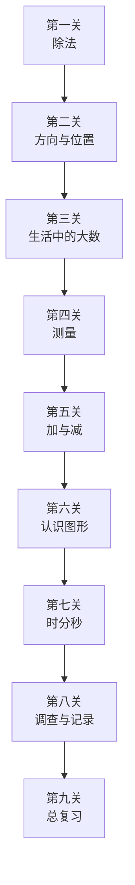

# 二年级数学下册（北师大版）通关知识库

## 教材信息

| 属性 | 内容 |
|------|------|
| 版本 | 北师大版 BSD |
| 年级 | 二年级下册 |
| 册次 | 第二学期 |
| 总课时 | 约53课时 |
| 核心单元 | 除法、生活中的大数、加与减、认识图形 |

---

## 📚 单元通关地图



---

## 第一关：除法 ⭐⭐⭐

### 关卡概览
- **课时**：8课时
- **通关标准**：理解除法意义 + 竖式计算 + 乘法口诀求商

### 核心知识点

#### 1.1 除法初步认识（分苹果）
```markdown
## 知识点：平均分
- 含义：每份分得同样多，就是平均分
- 表达：总数 ÷ 份数 = 每份数

## 生活例子
"有12个苹果，平均分给4个小朋友，每个小朋友分几个？"
→ 12 ÷ 4 = 3（个）

## 费曼讲解
用分糖果举例：
"妈妈买了12颗糖，要平均分给3个小朋友，
就像我们三个人分糖，每个人分得一样多，
每个人能分到几颗？"
```

#### 1.2 除法竖式（搭积木）
```markdown
## 除法竖式格式
       3    ← 商
    ─────
4 ) 1 2    ← 被除数
    1 2     ← 4×3=12
    ─────
     0     ← 余数

## 各部分名称
- 被除数 ÷ 除数 = 商 ... 余数
- 被除数 = 除数 × 商 + 余数

## 费曼讲解
"竖式就像搭积木，一层一层往上搭：
先看被除数里有几个除数，这是商；
商和除数相乘，得到要分掉的数；
被除数减去看分掉的，就是剩下的余数。"
```

#### 1.3 乘法口诀求商（捉迷藏）
```markdown
## 方法：用乘法口诀想除数×几=被除数

## 示例
12 ÷ 3 = ?
想：3 × 4 = 12
所以 12 ÷ 3 = 4

## 常见口诀求商
| 被除数 | 除数 | 想口诀 | 商 |
|--------|------|--------|---|
| 12 | 3 | 三四十二 | 4 |
| 24 | 6 | 四六二十四 | 4 |
| 36 | 9 | 四九三十六 | 4 |

## 苏格拉底追问
"12 ÷ 3=4，想想看，3×4=12说明什么？"
"如果换成12 ÷ 4，该想哪句口诀？"
```

#### 1.4 除法应用（快乐小屋）
```markdown
## 包含除 vs 等分除

### 等分除（平均分）
"把12个苹果平均分给3个小朋友，每个几个？"
12 ÷ 3 = 4（个）
→ 知道总数和份数，求每份数

### 包含除（几个一份）
"12个苹果，每个装4个，能装几袋？"
12 ÷ 4 = 3（袋）
→ 知道总数和每份数，求份数

## 区分方法
- 问"每个几个？"→ 等分除
- 问"能装几袋/几个？"→ 包含除
```

### 通关考核题
```markdown
1. 20 ÷ 4 = ?（用口诀求商）
2. 竖式计算：35 ÷ 5 = ?
3. 判断：把15本书平均分给5人，每人3本，是等分除还是包含除？
4. 应用：24颗糖，每6颗装一盒，能装几盒？
```

---

## 第二关：方向与位置

### 关卡概览
- **课时**：4课时
- **通关标准**：认识东南西北 + 能在图上辨认方向

### 核心知识点

```markdown
## 东南西北
       北
        ↑
        |
  西 ←  ·  → 东
        |
        ↓
       南

## 规律记忆
- 东对西，南对北
- 顺时针方向：北 → 东 → 南 → 西
- 太阳升起的方向是东，落下的方向是西

## 苏格拉底追问
"早晨，太阳从哪个方向升起？"
"如果你面朝北，你的左手边是哪个方向？"
"图书馆在学校的东边，学校在图书馆的哪个方向？"
```

### 通关考核题
```markdown
1. 填空：东对（ ），南对（ ）
2. 画图：学校在图书馆的西边，图书馆在学校的（ ）边
3. 说一说：从学校出发，去超市买完东西回家，怎么走？
```

---

## 第三关：生活中的大数 ⭐⭐⭐

### 关卡概览
- **课时**：8课时
- **通关标准**：认识千 + 数的组成 + 大小比较

### 核心知识点

#### 3.1 认识千（数一数）
```markdown
## 计数单位
个 → 十 → 百 → 千

## 关系
- 10个一是十
- 10个十是一百
- 10个一百是一千
- 一千 = 1000

## 数数规律（拐弯数）
- 99 + 1 = 100（九十九加一是多少？）
- 199 + 1 = 200
- 999 + 1 = 1000

## 苏格拉底追问
"999后面是几？"
"数到1000要用几个一百？"
```

#### 3.2 数的组成（拨一拨）
```markdown
## 例如：1234的组成
| 位 | 千位 | 百位 | 十位 | 个位 |
|----|------|------|------|------|
| 数 | 1 | 2 | 3 | 4 |
| 表示| 1千 | 2百 | 3十 | 4个 |

## 读数规则
- 从高位读起
- 中间有一个0或两个0，只读一个"零"
- 末尾的0不读

## 示例
- 1005 → 一千零五（中间的0要读）
- 3200 → 三千二百（末尾的0不读）
```

#### 3.3 大小比较（比一比）
```markdown
## 比较方法
1. 位数不同：位数多的数大
   - 四位数 > 三位数 > 二位数 > 一位数

2. 位数相同：从最高位比起
   - 2345 > 2256（千位相同，比百位）

## 示例
- 999和1000：1000更大（四位数 > 三位数）
- 3420和3240：3420更大（千位相同，4>2）

## 苏格拉底追问
"999和1000谁大？为什么？"
"3420和3240怎么比较？"
```

### 通关考核题
```markdown
1. 填空：10个一百是（ ），1000里面有（ ）个一百
2. 读数：8056、6060、6006
3. 比较大小：456○465，1000○999
4. 拨数：用计数器拨出"三千二百零八"
```

---

## 第四关：测量

### 关卡概览
- **课时**：5课时
- **通关标准**：认识长度单位 + 单位换算

### 核心知识点

```markdown
## 长度单位家族
毫米(mm) → 厘米(cm) → 分米(dm) → 米(m) → 千米(km)

## 单位换算
| 换算 | 关系 |
|------|------|
| 毫米↔厘米 | 1厘米 = 10毫米 |
| 厘米↔分米 | 1分米 = 10厘米 |
| 分米↔米 | 1米 = 10分米 |
| 米↔千米 | 1千米 = 1000米 |

## 易错点
- 毫米/厘米/分米/米：相邻进率是10
- 千米/米：进率是1000
- 不是所有相邻单位进率都是10！

## 生活参照
- 1毫米：银行卡厚度
- 1厘米：手指宽度
- 1分米：手掌宽度
- 1米：课桌高度
- 1千米：学校到操场的距离（绕操场2圈半）
```

### 通关考核题
```markdown
1. 填空：5米 =（ ）分米，3千米 =（ ）米
2. 判断：1米 = 100厘米，对吗？
3. 排序：5分米、50厘米、5米（从小到大）
```

---

## 第五关：加与减 ⭐⭐⭐

### 关卡概览
- **课时**：8课时
- **通关标准**：三位数竖式加减法 + 进位退位

### 核心知识点

#### 5.1 三位数加法（买电器）
```markdown
## 整百数加减
500 + 300 = 800
800 - 200 = 600

## 三位数笔算加法
    2 5 6
  + 1 4 3
  ───────
    3 9 9

## 进位加法
    3 8 7
  + 2 5 6
  ───────
    6 4 3
  ↑ 进位点

## 苏格拉底追问
"个位7+6=13，怎么写？"
"十位8+5再加进位的1等于几？"
```

#### 5.2 三位数减法（小蝌蚪）
```markdown
## 不退位减法
    5 6 8
  - 2 3 5
  ───────
    2 3 3

## 退位减法
    6 5 2    ← 被减数
  - 3 7 8    ← 减数
  ───────
    ? ? ?
  ↓ 退位点

## 退位规则
"0上有点，退1变成10；1上有点，退1变成11；..."

## 示例
    5 0 2
  - 3 2 7
  ───────
  十位0不够减，从百位退1
  10 - 2 = 8
  百位5退1变成4，4 - 3 = 1
  结果：175
```

#### 5.3 中间有0的加减法
```markdown
## 减法中间有0
    5 0 3
  - 2 0 1
  ───────
    3 0 2

## 连续退位
    5 0 0
  - 3 2 8
  ───────
  个位：0不够减，从十位退，十位是0，继续从百位退
  百位5退1剩4，十位10退1剩9，个位10-8=2
  十位9-2=7
  结果：172
```

### 通关考核题
```markdown
1. 竖式计算：456 + 278 = ?
2. 竖式计算：603 - 247 = ?
3. 找出错误：
       5 0 2
     - 3 2 8
     ───────
       1 7 4   ← 错在哪里？
4. 应用：书店原有526本书，卖出189本，还剩多少本？
```

---

## 第六关：认识图形 ⭐⭐⭐

### 关卡概览
- **课时**：6课时
- **通关标准**：认识角 + 直角 + 锐角 + 钝角

### 核心知识点

```markdown
## 角的组成
    /\
   /  \   ← 两条边
  /    \
 /______\
    ↑
   顶点

## 角的大小
角的大小与边的长短无关！
角的大小与两边张开程度有关！

## 三种角

### 直角
- 大小：90°
- 特征：像书本角、像方桌角
- 判定：用三角尺的直角去比

### 锐角
- 大小：比90°小
- 特征：像尖尖的东西
- 判定：比直角小

### 钝角
- 大小：比90°大，比180°小
- 特征：像打开的扇子
- 判定：比直角大

## 大小关系
锐角 < 直角 < 钝角
```

### 通关考核题
```markdown
1. 画一画：画一个直角、一个锐角、一个钝角
2. 判断：角的两条边越长，角就越大，对吗？
3. 分类：95°、90°、45°、120°、60°分别是哪种角？
```

---

## 第七关：时分秒 ⭐⭐

### 关卡概览
- **课时**：4课时
- **通关标准**：认识钟面 + 时分秒关系

### 核心知识点

```markdown
## 时分秒关系
1时 = 60分
1分 = 60秒

## 钟面认识
- 短针：时针
- 长针：分针
- 最细最长：秒针

## 换算
| 换算 | 关系 |
|------|------|
| 时↔分 | 1时 = 60分 |
| 分↔秒 | 1分 = 60秒 |
| 时↔秒 | 1时 = 3600秒 |

## 易错点
- 时间进率是60，不是10！
- "时"是时刻，"分/秒"是时长
```

### 通关考核题
```markdown
1. 填空：2时 =（ ）分，3分 =（ ）秒
2. 判断：1分 = 100秒，对吗？
3. 排序：30秒、1分、90秒（从短到长）
```

---

## 第八关：调查与记录

### 关卡概览
- **课时**：4课时
- **通关标准**：收集数据 + 整理成统计表

### 核心知识点

```markdown
## 调查方法
1. 举手表决
2. 投票
3. 问卷调查

## 统计表格式
| 最喜欢的水果 | 人数 |
|-------------|------|
| 苹果 | 正正 10 |
| 香蕉 | 正正正 15 |
| 橘子 | 正 5 |

## 读统计表
- 哪种最多？香蕉（15人）
- 哪种最少？橘子（5人）
- 一共调查了多少人？30人
```

---

## 🏆 通关知识卡（速查）

### 计算口诀
```markdown
| 除法口诀 | 加法进位 | 减法退位 |
|---------|---------|---------|
| 商×除数=被除数 | 满十进一 | 借一当十 |
| 三四十二 → 12÷3=4 | 个位相加≥10 | 个位不够减 |
| 四六二十四 → 24÷6=4 | 十位要加进位的1 | 十位要减退位的1 |
```

### 单位换算速查
```markdown
| 长度 | 毫米←→厘米←→分米←→米 ←→ 千米 |
| 关系 | 10←10←10←10 ←1000 |
| 时间 | 时←→分←→秒 |
| 关系 | 60←60 |
```

### 图形特征
```markdown
| 图形 | 特征 | 角的大小 |
|------|------|----------|
| 锐角 | 尖尖的 | < 90° |
| 直角 | 方方的 | = 90° |
| 钝角 | 钝钝的 | > 90° |
```

---

## 📖 费曼讲解范例库

### 除法讲解
```
"想象你有一堆糖果要分给小朋友。
如果有12颗糖，分给3个人，
就像我们三个人分糖一样，
每个人分到的要一样多。
数一数，每个人手里有几颗？
对，是4颗！
这就是除法，像分东西一样。"
```

### 角的大小讲解
```
"角的大小和边的长短没关系！
看老师的三角尺，边很长，
但是直角就那么大。
角的大小要看两边张开多少。
像打开的书，比直角大，是钝角；
像合起来的书，比直角小，是锐角。"
```

### 时间单位讲解
```
"时间就像接力赛：
时针跑得最慢，一步是一个小时；
分针跑得中等，一步是一分钟；
秒针跑得最快，一步是一秒钟。
时针走一步，分针要走一圈；
分针走一步，秒针要走一圈。
所以1小时=60分钟，1分钟=60秒钟。
进率是60，不是10哦！"
```

---

## 🎮 趣味练习游戏

### 1. 除法分糖果
```
道具：糖果（或用图片代替）
玩法：两人一组，一人出题"把XX颗糖平均分给X人"，
      另一人用糖果实际操作，说出结果。
```

### 2. 方向小侦探
```
道具：教室平面图
玩法：在教室不同位置藏"宝藏"，
      用"在XX的东边/西边/南边/北边"描述位置，
      其他同学根据描述找宝藏。
```

### 3. 角的大小比一比
```
道具：纸折的角或三角尺
玩法：两人各折一个角，比一比谁的大，
      用直角三角尺验证结果。
```

### 4. 时间小主人
```
道具：钟面教具
玩法：老师说时间，学生拨针；
      或学生说时间，老师拨针检查。
```

---

## 📊 知识掌握评估表

| 关卡 | 知识要点 | 掌握程度 | 需要加强 |
|------|---------|---------|---------|
| 第一关 除法 | 除法意义、竖式、口诀求商 | ⬜ | |
| 第二关 方向 | 东南西北、相对关系 | ⬜ | |
| 第三关 大数 | 计数单位千、数的组成、比较大小 | ⬜ | |
| 第四关 测量 | 长度单位、换算 | ⬜ | |
| 第五关 加减 | 三位数竖式、进位退位 | ⬜ | |
| 第六关 图形 | 角的认识、三种角 | ⬜ | |
| 第七关 时分秒 | 钟面认识、单位换算 | ⬜ | |
| 第八关 统计 | 数据收集、统计表 | ⬜ | |

---

## 🔗 知识衔接索引

| 本册知识 | 上接知识 | 下延知识 |
|---------|---------|---------|
| 除法 | 一年级表内除法 | 三年级除法竖式 |
| 大数(千) | 一年级100以内数 | 三年级万以内数 |
| 测量 | 二年级上册厘米米 | 三年级测量综合 |
| 三位数加减 | 二年级上册100以内加减 | 三年级万以内加减 |
| 认识角 | 二年级上册角初步 | 三年级四边形 |
| 时分秒 | 二年级上册认识半时 | 三年级时分秒综合 |

---

*本知识库供小学数学老师智能体使用*
*最后更新：2026-04-22*
