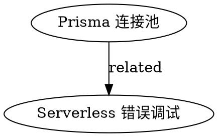

# 🕸️ 知识图谱系统

## 核心功能

### 1. 图谱构建
- **节点提取**：从技能元数据提取实体
- **关系发现**：分析技能间的依赖和关联
- **权重计算**：基于引用频率和相似度

### 2. 可视化
- **力导向布局**：自动布局节点和边
- **聚类展示**：按类别/主题分组
- **交互探索**：点击节点展开关联

### 3. 分析功能
- **路径查找**：发现技能之间的学习路径
- **知识缺口**：识别缺失的中间技能
- **影响力分析**：找出核心技能和孤立技能

## 数据结构

### 节点 (Node)
```typescript
interface SkillNode {
  id: string;              // 技能 ID
  name: string;            // 技能名称
  category: string;        // 分类
  qualityScore: number;    // 质量评分
  usageCount: number;      // 使用次数
  createdAt: string;       // 创建时间
  tags: string[];          // 标签
  technologies: string[];  // 相关技术
}
```

### 边 (Edge)
```typescript
interface SkillEdge {
  source: string;      // 源技能 ID
  target: string;      // 目标技能 ID
  type: 'depends' | 'related' | 'prerequisite' | 'alternative';
  weight: number;      // 关系强度 (0-1)
  reason: string;      // 关系原因
}
```

## 图谱构建算法

### 1. 关系发现
```typescript
function discoverRelationships(skills: Skill[]): SkillEdge[] {
  const edges: SkillEdge[] = [];

  for (const a of skills) {
    for (const b of skills) {
      if (a.id === b.id) continue;

      // 技术重叠
      const techOverlap = intersection(a.technologies, b.technologies);
      if (techOverlap.length > 0) {
        edges.push({
          source: a.id,
          target: b.id,
          type: 'related',
          weight: techOverlap.length / Math.max(a.technologies.length, b.technologies.length),
          reason: `共享技术: ${techOverlap.join(', ')}`
        });
      }

      // 描述相似度
      const similarity = cosineSimilarity(a.description, b.description);
      if (similarity > 0.7) {
        edges.push({
          source: a.id,
          target: b.id,
          type: 'related',
          weight: similarity,
          reason: '描述相似'
        });
      }

      // 引用关系
      if (b.description.includes(a.name)) {
        edges.push({
          source: b.id,
          target: a.id,
          type: 'depends',
          weight: 1.0,
          reason: '在描述中引用'
        });
      }
    }
  }

  return edges;
}
```

### 2. 路径查找
```typescript
function findLearningPath(graph: Graph, start: string, end: string): Skill[] {
  // BFS 查找最短路径
  const queue = [[start]];
  const visited = new Set([start]);

  while (queue.length > 0) {
    const path = queue.shift()!;
    const current = path[path.length - 1];

    if (current === end) {
      return path.map(id => graph.getNode(id));
    }

    for (const neighbor of graph.getNeighbors(current)) {
      if (!visited.has(neighbor)) {
        visited.add(neighbor);
        queue.push([...path, neighbor]);
      }
    }
  }

  return []; // 无路径
}
```

### 3. 知识缺口检测
```typescript
function detectKnowledgeGaps(graph: Graph): Gap[] {
  const gaps: Gap[] = [];

  for (const node of graph.getNodes()) {
    const neighbors = graph.getNeighbors(node.id);

    // 孤立技能（无连接）
    if (neighbors.length === 0) {
      gaps.push({
        type: 'isolated',
        node: node.id,
        suggestion: '此技能未被引用，考虑删除或添加相关技能'
      });
    }

    // 桥接缺口（两步之间缺少中间技能）
    for (const neighbor of neighbors) {
      const edge = graph.getEdge(node.id, neighbor);
      if (edge && edge.weight > 0.8) {
        // 强关联但无直接路径
        const hasDirectPath = graph.getShortestPath(node.id, neighbor).length <= 2;
        if (!hasDirectPath) {
          gaps.push({
            type: 'missing_intermediate',
            from: node.id,
            to: neighbor,
            suggestion: `考虑创建连接 ${node.name} 和 ${neighbor.name} 的中间技能`
          });
        }
      }
    }
  }

  return gaps;
}
```

## 可视化配置

```typescript
const visualizationConfig = {
  layout: 'force-directed',
  nodeSize: (node: SkillNode) => 10 + node.usageCount * 2,
  nodeColor: (node: SkillNode) => categoryColors[node.category],
  edgeWidth: (edge: SkillEdge) => edge.weight * 5,
  edgeColor: (edge: SkillEdge) => relationshipColors[edge.type],
  label: (node: SkillNode) => node.name,
  physics: {
    repulsion: 200,
    springLength: 100,
    springCoefficient: 0.05
  }
};
```

## 导出格式

### JSON 格式
```json
{
  "nodes": [
    { "id": "skill-1", "name": "Prisma 连接池", "category": "error" }
  ],
  "edges": [
    { "source": "skill-1", "target": "skill-2", "type": "related", "weight": 0.8 }
  ]
}
```

### Graphviz DOT 格式


## 使用示例

```bash
# 构建知识图谱
/knowledge-graph build

# 可视化图谱
/knowledge-graph visualize

# 查找学习路径
/knowledge-graph path --from prisma-pool --to serverless-error

# 检测知识缺口
/knowledge-graph gaps

# 导出图谱
/knowledge-graph export --format json --output skills-graph.json
```

## 分析报告

```
🕸️ 知识图谱分析报告
━━━━━━━━━━━━━━━━━━━━━━━━━━━━━━━━━━━━━━━━━━━━━━━━━━━━

📊 图谱统计:
  • 节点数: 24 个技能
  • 边数: 67 个关系
  • 平均度: 5.58
  • 直径: 4
  • 聚类系数: 0.62

🔍 核心技能 (影响力 Top 5):
  1. prisma-connection-pool (度: 12, 介数: 0.45)
  2. nextjs-ssr-error (度: 10, 介数: 0.38)
  3. typescript-circular-dep (度: 8, 介数: 0.31)
  4. serverless-timeout (度: 7, 介数: 0.28)
  5. react-useeffect-cleanup (度: 6, 介数: 0.25)

⚠️  知识缺口:
  • 孤立技能: 2 个
  • 缺少中间技能: 3 处
  • 建议新技能: 5 个

💡 建议:
  1. 将孤立技能 "old-webpack-config" 合并到相关技能或删除
  2. 创建连接 "prisma-pool" 和 "serverless-error" 的中间技能
  3. 补充 "docker-network" 相关技能以完善 DevOps 知识网络
```
