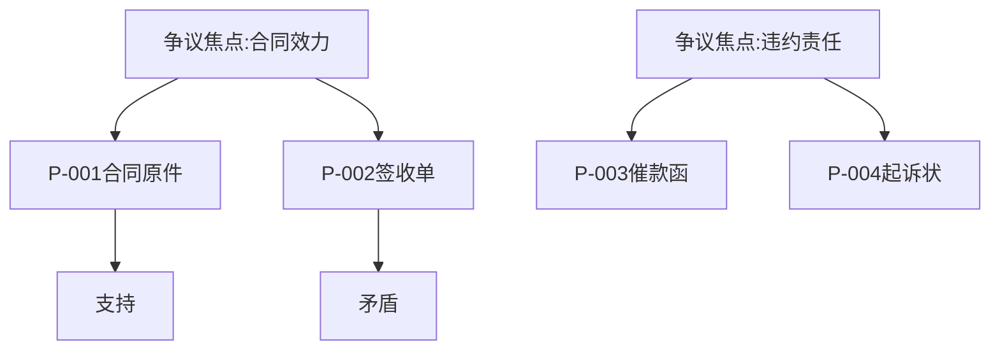

# claim-chart-builder - 诉讼图表构建

## L0: 一句话描述 (≤15字)
诉讼请求可视化与时间线构建

## L1: 使用场景 (50-100字)
诉讼支持工程师将案件档案中的诉讼请求、事实主张、证据材料转化为可视化图表，包括诉讼请求结构图、事实时间线、证据关联图。适用于73-05诉讼支持工程师的案件分析和73-03风控师的风险评估场景。

## L2: 详细文档

### 核心能力

1. **诉讼请求结构图**
   - 本诉请求与反诉请求
   - 请求权基础（合同/侵权/不当得利等）
   - 请求金额与计算方式

2. **事实时间线**
   - 法律事件编年（Chronological Timeline）
   - 关键事实节点标注
   - 因果关系链可视化

3. **证据关联图**
   - 证据与争议焦点映射
   - 证据链完整性分析
   - 证据弱点标注

4. **法律关系图**
   - 当事人法律关系
   - 合同/协议的层级结构
   - 担保/连带责任标注

### 图表类型矩阵

| 图表类型 | 适用场景 | 核心元素 |
|----------|---------|---------|
| **诉讼请求树** | 本诉+反诉结构 | 请求节点/金额/依据 |
| **事实时间线** | 事件编年 | 日期/事件/证据/责任人 |
| **证据网络图** | 证据关联分析 | 证据节点/争议焦点/连线 |
| **法律关系图** | 当事人关系 | 当事人/合同/担保/责任 |
| **因果链图** | 损害因果分析 | 行为/损害/因果/责任 |

### 输出格式

```yaml
诉讼图表:
  case_id: string
  chart_type: "claim_tree|timeline|evidence_network|legal_relationship|causation"

  nodes:
    - id: string
      type: "claim|fact|evidence|party|contract"
      label: string
      metadata: {}

  edges:
    - source: string
      target: string
      type: "supports|contradicts|causes|requires"
      weight: number

  metadata:
    created_date: date
    author: string
    version: string
```

### 使用命令

```bash
# 生成诉讼请求结构图
/claim-chart-builder claim-tree --case-id "CTR-001" --output ./charts/claim-tree.md

# 生成事实时间线
/claim-chart-builder timeline --case-id "CTR-001" --start-date "2024-01-01" --output ./charts/timeline.md

# 生成证据关联图
/claim-chart-builder evidence-network --case-id "CTR-001" --output ./charts/evidence.md

# 生成法律关系图
/claim-chart-builder legal-relationship --case-id "CTR-001" --output ./charts/relationships.md

# 生成因果链图
/claim-chart-builder causation --case-id "CTR-001" --harm "财务损失" --output ./charts/causation.md

# 批量生成所有图表
/claim-chart-builder generate-all --case-id "CTR-001" --output-dir ./charts
```

### 图表生成模板

```markdown
## 诉讼请求结构图

### 本诉请求
1. **[请求1]** 支付货款 ¥500,000
   - 依据: 《民法典》第598条
   - 计算: 合同总价 - 已付款项

2. **[请求2]** 支付违约金 ¥50,000
   - 依据: 合同第12条违约条款
   - 计算: 合同金额 × 10%

### 反诉请求（如有）
1. **[反诉1]** 解除合同
   - 依据: 《民法典》第563条

---

## 事实时间线

| 日期 | 事件 | 证据 | 责任人 |
|------|------|------|--------|
| 2024-01-15 | 签订合同 | P-001 合同原件 | 双方 |
| 2024-03-01 | 交付货物 | P-002 签收单 | 原告 |
| 2024-03-15 | 到期未付款 | P-003 催款函 | 被告 |
| 2024-05-01 | 提起诉讼 | P-004 起诉状 | 原告 |

---

## 证据关联图


```

### 与MCP连接器协同

```yaml
MCP连接器:
  firefox-tech-graph: 图表生成引擎

数据流:
  demand-intake → 案件档案 → claim-chart-builder → 图表输出
  claim-chart-builder → 案件档案 → 路由至73-05/73-03
```

### 更新日志

| 版本 | 日期 | 变更 |
|------|------|------|
| V1.0 | 2026-05-14 | V11.12初始集成，基于Claude for Legal claim-chart-builder |