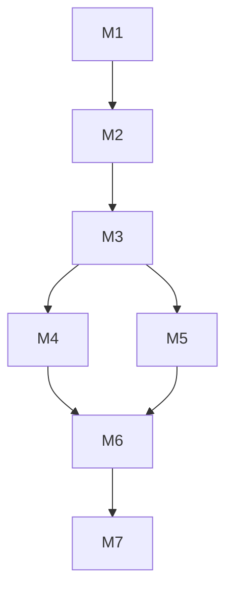

# Meta Task Decomposition - 元任务分解

> 基于"元：从混沌许愿到系统治理"方法论，把复杂任务拆成"最小可治理单元"

## L0: 一句话描述
将复杂任务分解为满足4个条件的"元"，直接产出一张"元架构作战图"。

## L1: 使用场景
- 复杂多步骤任务需要拆解
- 需要明确责任边界和执行顺序
- 产出可视化作战图指导执行

## L2: 详细文档

### 元的定义（4个条件）

```
┌─────────────────────────────────────────────────────────────┐
│                      元 META 的4个条件                       │
├─────────────────────────────────────────────────────────────┤
│                                                             │
│  1. 独立说清                                                │
│     → 一句话能说清楚这个元是做什么的                        │
│     → 不需要依赖其他元来理解它的目的                        │
│                                                             │
│  2. 能定位                                                  │
│     → 有明确的执行者（Agent/岗位/人）                       │
│     → 有明确的输入输出                                     │
│                                                             │
│  3. 可替换                                                  │
│     → 元内部变化不影响其他元                               │
│     → 可以独立替换实现方式                                  │
│                                                             │
│  4. 可复用                                                  │
│     → 这个元的形式可以被其他场景复用                        │
│     → 不是为单一任务定制                                    │
│                                                             │
└─────────────────────────────────────────────────────────────┘
```

### 元架构作战图格式

```markdown
# 元架构作战图: [任务名称]

## 元清单

| 元ID | 名称 | 执行者 | 输入 | 输出 | 依赖 | 可复用场景 |
|------|------|--------|------|------|------|-----------|
| M1 | 需求理解 | 00分析师 | 原始请求 | 需求文档 | - | 需求分析 |
| M2 | 技术调研 | 01调研师 | 需求文档 | 技术报告 | M1 | 技术评估 |
| M3 | 架构设计 | 02架构师 | 技术报告 | 架构图 | M2 | 架构规划 |
| M4 | 代码实现 | 03构建师 | 架构图 | 代码 | M3 | 开发任务 |
| ... | ... | ... | ... | ... | ... | ... |

## 依赖关系图



## 关键路径

[按执行顺序排列的关键元]

## 风险点

[识别的高风险元及其缓解策略]
```

### 核心流程

```
复杂任务
    ↓
Step 1: 识别业务目标（不是技术目标）
    ↓
Step 2: 识别"最小可交付价值"
    ↓
Step 3: 分解为元（满足4个条件）
    ↓
Step 4: 组织镜像（映射到天龙岗位）
    ↓
Step 5: 节奏编排（顺序/并行/依赖）
    ↓
Step 6: 意图放大（验证每个元确实放大原始意图）
    ↓
元架构作战图
```

### 迭代命令

| 命令 | 功能 | 示例 |
|------|------|------|
| `/拆元` | 启动元任务分解 | `/拆元 帮我做一场100人的AI技术沙龙` |
| `再拆细X` | 把指定元继续分解 | `再拆细M3` |
| `合并X Y` | 合并两个元 | `合并M4 M5` |
| `加个元` | 添加新元 | `加个元 M6.5: 客户访谈` |
| `换个案例` | 用不同领域的案例重新拆解 | `换个案例: 电商订单系统` |
| `画作战图` | 输出可视化作战图 | `画作战图` |

### 与天龙岗位映射

| 元类型 | 天龙岗位 | 职责 |
|--------|---------|------|
| 理解元 | 00分析师 | 需求理解、目标澄清 |
| 调研元 | 01调研师 | 信息收集、技术评估 |
| 设计元 | 02架构师 | 方案设计、架构规划 |
| 构建元 | 03构建师 | 编码实现、单元测试 |
| 验证元 | 04验证师 | 测试验证、质量保证 |
| 安全元 | 05安全师 | 安全审查、漏洞修复 |
| 审查元 | 06审查师 | 代码审查、最终审计 |
| 记录元 | 07记录师 | 文档编写、经验沉淀 |
| 发布元 | 08发布师 | 部署发布、监控维护 |

### 使用示例

**输入**:
```
/拆元 帮我优化用户登录系统，要求支持微信登录和手机号登录
```

**输出**:
```
# 元架构作战图: 用户登录系统优化

## 元清单

| 元ID | 名称 | 执行者 | 输入 | 输出 | 依赖 | 可复用场景 |
|------|------|--------|------|------|------|-----------|
| M1 | 登录需求分析 | 00分析师 | 原始需求 | 登录需求文档 | - | 登录系统 |
| M2 | 技术选型调研 | 01调研师 | 需求文档 | 技术选型报告 | M1 | 认证系统 |
| M3 | 微信登录实现 | 03构建师 | 技术报告 | 微信OAuth代码 | M2 | OAuth集成 |
| M4 | 手机号登录实现 | 03构建师 | 技术报告 | 手机号认证代码 | M2 | 手机认证 |
| M5 | 统一登录门面 | 02架构师 | M3+M4 | 登录Facade | M3,M4 | 门面模式 |
| M6 | 安全测试 | 04验证师 | 代码 | 测试报告 | M3,M4,M5 | 安全测试 |
| M7 | 灰度发布 | 08发布师 | 代码 | 上线 | M6 | 灰度发布 |

## 依赖关系图

M1 → M2 → M3
           → M4
           ↓
         M5 → M6 → M7

## 关键路径
M1 → M2 → M3 → M5 → M6 → M7 (预计4小时)

## 风险点
- M2技术选型可能影响整体架构，需优先完成
- M3和M4可并行执行，加速整体进度
```

## 来源

- GitHub: https://github.com/AAAAAAAJ/meta-task-decomposition
- Stars: 1
- 理念: "元：从混沌许愿到系统治理"