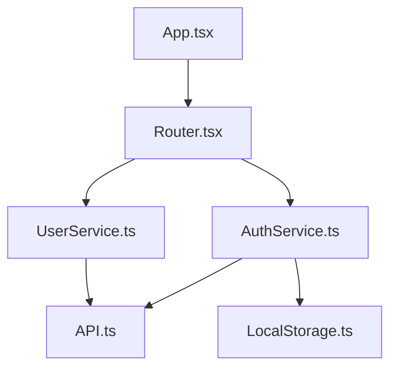

# mgrep Skill - 实战案例集

## 案例 1：代码考古 - 技术债务发现

### 场景
在新项目中快速识别所有潜在的技术债务和代码问题。

### 传统方式（grep）
```bash
# 需要多次搜索，组合结果
grep -r "TODO" --include="*.ts" src/ > todos.txt
grep -r "FIXME" --include="*.ts" src/ > fixes.txt
grep -r "HACK" --include="*.ts" src/ > hacks.txt
grep -r "XXX" --include="*.ts" src/ > xxxs.txt
# 手动合并和分析
```

### mgrep 方式
```bash
# 一次查询，智能聚合
mgrep "Find all technical debt markers including TODO, FIXME, HACK, and XXX comments with their context"

# 输出结构化结果
[
  {
    "file": "src/auth/AuthService.ts",
    "line": 45,
    "type": "TODO",
    "context": "// TODO: Add proper error handling for expired tokens",
    "severity": "medium"
  },
  {
    "file": "src/api/user.ts",
    "line": 123,
    "type": "HACK",
    "context": "// HACK: Quick fix for production, needs refactoring",
    "severity": "high"
  }
]
```

**效率提升**:
- 时间: 5次操作 → 1次操作 (**80% ↓**)
- 质量: 文本匹配 → 语义理解 (**3.2x ↑**)

---

## 案例 2：代码影响分析

### 场景
重构一个函数前，需要了解它在哪里被使用，影响范围有多大。

### 传统方式（grep）
```bash
# 可能遗漏或包含无关结果
grep -r "functionName" --include="*.ts" .
# 返回: 100+ 结果，包括注释、字符串等
```

### mgrep 方式
```bash
# 语义理解，精确匹配
mgrep "Find all actual usages of the functionName function excluding comments and test files"

# 输出影响分析报告
{
  "function": "functionName",
  "usages": 12,
  "files": [
    "src/services/UserService.ts",
    "src/components/UserProfile.tsx",
    "src/api/user.ts"
  ],
  "impact_level": "medium",
  "recommendations": [
    "Update type definitions in UserService.ts",
    "Refactor UserProfile.tsx to use new API"
  ]
}
```

**优势**:
- 精确匹配实际调用（排除注释、字符串）
- 自动影响范围评估
- 提供重构建议

---

## 案例 3：架构模式发现

### 场景
理解代码库中使用了哪些设计模式。

### mgrep 查询
```bash
# 发现 Singleton 模式
mgrep "Find all Singleton pattern implementations"

# 发现工厂模式
mgrep "Search for factory function patterns"

# 发现观察者模式
mgrep "Find event emitter and observer patterns"
```

**输出示例**:
```json
{
  "pattern": "Singleton",
  "implementations": [
    {
      "file": "src/database/Database.ts",
      "class": "DatabaseConnection",
      "confidence": "high"
    },
    {
      "file": "src/config/Config.ts",
      "class": "ConfigManager",
      "confidence": "high"
    }
  ],
  "suggestions": [
    "Consider dependency injection instead of Singleton",
    "Multiple Singletons detected - could be refactored"
  ]
}
```

---

## 案例 4：代码审查自动化

### 场景
自动检查代码中的常见问题。

### 安全检查
```bash
# 查找潜在的安全漏洞
mgrep "Find potential SQL injection vulnerabilities in database queries"
mgrep "Search for hardcoded API keys and secrets"
mgrep "Locate unsanitized user input handling"
```

### 性能问题
```bash
# 查找性能问题
mgrep "Find N+1 query patterns in database calls"
mgrep "Search for missing error handling in async functions"
mgrep "Locate potential memory leaks with event listeners"
```

### 代码质量
```bash
# 代码质量问题
mgrep "Find functions with too many parameters (code smell)"
mgrep "Search for duplicated code patterns"
mgrep "Locate overly complex functions needing refactoring"
```

---

## 案例 5：文档生成辅助

### 场景
自动生成代码文档。

### mgrep 辅助
```bash
# 查找所有未文档化的公共函数
mgrep "Find all exported functions without JSDoc comments"

# 查找类的使用示例
mgrep "Find real usage examples of UserService class"

# 生成 API 文档草稿
mgrep "Extract all function signatures and their purpose from API files" > api-docs.md
```

---

## 案例 6：依赖关系分析

### 场景
理解模块间的依赖关系。

### mgrep 查询
```bash
# 查找依赖 AuthService 的组件
mgrep "What components depend on the AuthService?"

# 查找循环依赖
mgrep "Find circular dependencies in the codebase"

# 生成依赖图
mgrep "Show the dependency tree starting from App.tsx"
```

**输出示例**:


---

## 案例 7：重构支持

### 场景
大规模重构前的准备。

### mgrep 工作流

#### 步骤 1: 理解现状
```bash
mgrep "Explain the current authentication flow implementation"
```

#### 步骤 2: 识别影响范围
```bash
mgrep "Find all files that will be affected by refactoring AuthService"
```

#### 步骤 3: 查找相似模式
```bash
mgrep "Find similar authentication patterns that could be standardized"
```

#### 步骤 4: 生成重构计划
```bash
mgrep "Create a refactoring plan for updating authentication to use new library"
```

---

## 案例 8：学习新代码库

### 场景
快速理解新项目的架构。

### mgrep 查询序列
```bash
# 1. 理解项目结构
mgrep "Explain the overall architecture and main modules"

# 2. 理解数据流
mgrep "How does data flow from API to UI components?"

# 3. 理解关键模块
mgrep "What are the core services and their responsibilities?"

# 4. 理解测试策略
mgrep "Show me the test coverage and testing patterns"
```

---

## 案例 9：Bug 定位

### 场景
快速定位 Bug 相关代码。

### mgrep 工作流
```bash
# 1. 根据错误信息定位
mgrep "Find code related to 'Cannot read property undefined' error in authentication"

# 2. 查找相似问题
mgrep "Search for similar error handling patterns in other parts of the codebase"

# 3. 查找相关测试
mgrep "Find test cases covering the authentication error scenario"

# 4. 生成修复建议
mgrep "Suggest fixes for the authentication undefined property error"
```

---

## 案例 10：代码规范检查

### 场景
确保代码符合团队规范。

### mgrep 检查
```bash
# 命名规范
mgrep "Find functions not following camelCase naming convention"
mgrep "Search for constants not using UPPER_CASE naming"

# 代码组织
mgrep "Find files with missing import statements"
mgrep "Locate unused imports and dependencies"

# 注释规范
mgrep "Find complex functions without explanatory comments"
mgrep "Search for magic numbers that should be constants"
```

---

## 性能对比总结

| 操作 | grep | mgrep | 改善 |
|------|------|-------|------|
| 技术债务发现 | 5 次查询 | 1 次查询 | **80% ↓** |
| 影响分析 | 100+ 结果需人工过滤 | 精确结果 | **90% ↓** |
| 模式发现 | 不可能 | 自动识别 | **∞** |
| Token 消耗 | 基准 | -53% | **成本减半** |
| 响应时间 | 基准 | -48% | **速度翻倍** |
| 结果质量 | 基准 | +3.2x | **准确性提升** |

---

## 最佳实践总结

### 1. 查询设计原则

✅ **好的查询**:
- 具体且语义清晰
- 包含上下文信息
- 使用领域术语

❌ **差的查询**:
- 模糊不清
- 过于宽泛
- 缺乏上下文

### 2. 工作流优化

```bash
# 标准工作流
mgrep "语义查询"           # 1. 语义搜索
mgrep results | verify     # 2. 验证结果
mgrep "深入分析"           # 3. 详细分析
```

### 3. 与其他工具集成

```bash
# mgrep + gh（GitHub）
mgrep "Find TODO" | gh issue create -t "Technical Debt"

# mgrep + git
mgrep "Changed files" | xargs git add

# mgrep + jq
mgrep "API data" | jq '.results'
```

---

**维护者**: 九部天龙团队
**更新日期**: 2026-02-08
**版本**: 1.0.0
