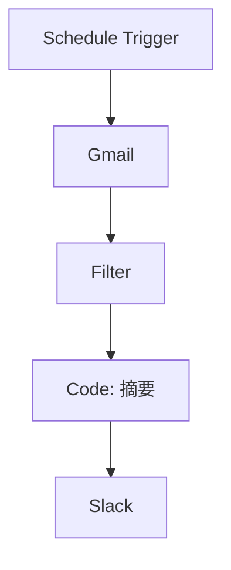

# Step 03: 方案讨论

## 目标
基于研究发现，与用户讨论并确认最终方案，确保方案符合预期。

## 执行流程

### 1. 展示研究摘要

简洁呈现研究关键发现：

```markdown
## 研究摘要

根据您的需求 "[用户原始需求]"，我们发现了以下方案：

### 📋 发现的方案

**方案A: 简单直接** (⭐ 推荐用于初学者)
- 节点: Schedule → Gmail → Filter → Slack
- 优势: 简单、稳定、易于维护
- 劣势: 功能较基础
- 预计构建时间: 5分钟

**方案B: 增强版** (⭐⭐ 推荐用于一般用途)
- 节点: Schedule → Gmail → Filter → Code (摘要) → Slack
- 优势: 添加了智能摘要功能
- 劣势: 需要编写少量代码
- 预计构建时间: 10分钟

**方案C: 高级版** (⭐⭐⭐ 推荐用于高级用户)
- 节点: Schedule → Gmail → IF → AI Agent (分析) → Slack
- 优势: AI驱动，智能分类和处理
- 劣势: 需要OpenAI API，有成本
- 预计构建时间: 15分钟

### 🎯 推荐
基于您的需求，我们推荐 **方案B**，因为：
- 平衡了功能和复杂度
- 代码节点易于自定义
- 无需额外API成本
```

### 2. 用户3轮调整

允许用户提出修改意见：

#### 第1轮：功能调整
```
用户可能的反馈:
- "我需要添加XXX功能"
- "这个节点可以换成YYY吗"
- "能否同时处理多个来源"

处理方式:
- 评估影响
- 提供替代方案
- 更新节点列表
```

#### 第2轮：细节确认
```
确认项:
- 触发频率是否合适
- 过滤条件是否完整
- 输出格式是否满足需求
- 错误处理是否充分

处理方式:
- 逐项确认
- 记录用户选择
- 更新配置参数
```

#### 第3轮：最终确认
```
确认项:
- 方案是否满足需求
- 是否有遗漏的功能
- 是否可以开始构建

处理方式:
- 获得明确确认
- 锁定方案内容
- 进入下一步
```

### 3. confirmed_plan 锁定

一旦用户确认，生成最终方案文档：

```markdown
# 确认方案

## 基本信息
- **工作流名称**: [用户确认的名称]
- **方案版本**: [A/B/C 或自定义]
- **确认时间**: [timestamp]

## 节点序列



## 节点清单

| # | 节点 | 类型 | 配置要点 |
|---|------|------|----------|
| 1 | Schedule Trigger | 内置 | cron: 0 9 * * 1-5 |
| 2 | Gmail | 内置 | label:IMPORTANT |
| 3 | Filter | 内置 | conditions: 见下方 |
| 4 | Code | 内置 | JavaScript: 摘要生成 |
| 5 | Slack | 内置 | channel: #alerts |

## 关键配置

### Filter 节点条件
```javascript
$json.labelIds.includes('IMPORTANT') && $json.labelIds.includes('UNREAD')
```

### Code 节点逻辑
```javascript
// 生成50字摘要
const email = $input.first().json;
const summary = email.snippet?.substring(0, 50) + '...';
return [{ json: { ...email, summary } }];
```

### Slack 消息格式
```javascript
🔔 **{{ $json.subject }}**

{{ $json.summary }}

来自: {{ $json.from }}
```

## 用户确认项
- [x] 触发时间: 工作日早上9点
- [x] 过滤条件: 重要且未读
- [x] 摘要长度: 50字
- [x] 通知频道: #alerts

## 下一步
Step 04: 查询节点详细知识 → Step 05: 生成架构设计
```

### 4. 模板快速路径

如果发现高度匹配的模板，可询问用户：

```markdown
## 🎁 发现匹配模板

我们发现了一个与您的需求高度匹配的模板：

**模板名称**: [名称]
**相似度**: 95%
**差异**: [列出差异]

**选项1**: 使用模板快速部署
- 优势: 快速、已验证
- 需要: 手动调整差异部分

**选项2**: 从零构建
- 优势: 完全定制
- 需要: 更多构建时间

您希望使用哪种方式？
```

## 输出格式

### discussion.md

```markdown
# 方案讨论记录

## 研究摘要展示
[上述研究摘要内容]

## 用户反馈记录

### 第1轮反馈
**用户**: [用户意见]
**分析**: [影响分析]
**调整**: [方案调整]

### 第2轮反馈
**用户**: [用户意见]
**调整**: [方案调整]

### 第3轮确认
**用户**: [确认意见]
**状态**: ✅ 确认 / ❌ 需要调整

## 最终方案
[confirmed_plan 内容]

## 讨论过程中的关键决策
| 决策点 | 用户选择 | 理由 |
|--------|----------|------|
| 触发频率 | 每工作日9点 | 用户只在关心工作邮件 |
| AI分析 | 不使用 | 成本考虑 |
| 错误通知 | 需要添加 | 用户要求 |
```

## 验证条件

- [ ] 研究摘要已展示给用户
- [ ] 完成3轮用户调整（或用户提前确认）
- [ ] 所有关键决策已记录
- [ ] 用户明确确认方案
- [ ] confirmed_plan 已生成
- [ ] discussion.md 已保存

## 错误处理

| 情况 | 处理 |
|------|------|
| 用户需求模糊 | 提供具体选项供选择 |
| 用户频繁改变 | 提示确认关键决策点 |
| 技术不可行 | 解释限制并提供替代方案 |
| 用户不确定 | 推荐默认方案，说明可后续调整 |

## 下一步

Step 04: 知识库查询 - 查询节点详细配置和最佳实践
