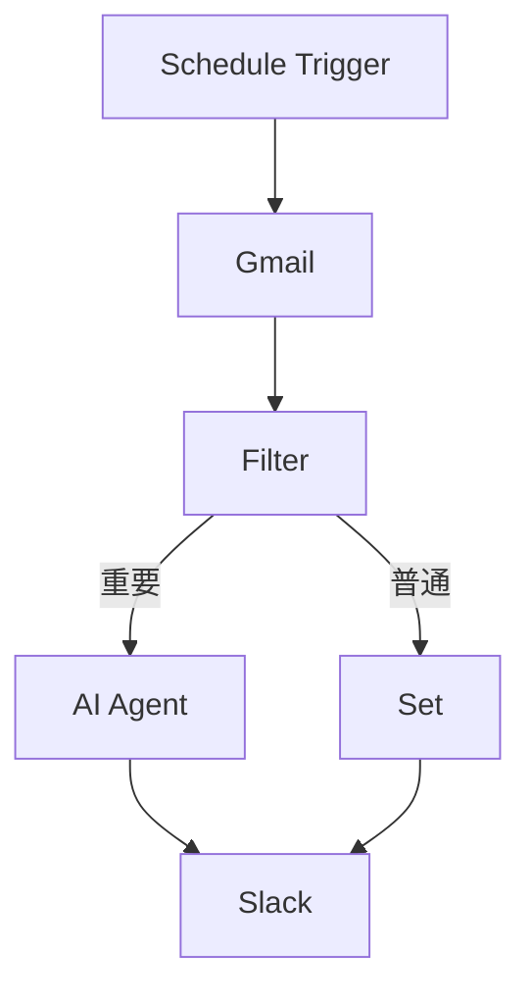

# Step 05: 架构设计

## 目标
基于确认的方案，输出完整的工作流设计文档。

## 执行流程

### 1. 节点清单生成

使用 `n8n-mcp` 的 `search_nodes` 或查询 INDEX.md，确定每个节点的：

```yaml
节点信息:
  id: "@n8n/n8n-nodes-gmail"
  displayName: "Gmail"
  typeVersion: 2
  inputs: ["main"]
  outputs: ["main"]
  properties:
    - operation: "getAll"
    - resource: "message"
    - filters: { ... }
```

### 2. 拓扑结构设计

定义节点连接关系：



### 3. 表达式规划

列出所有需要使用 n8n 表达式的地方：

| 节点 | 字段 | 表达式 | 说明 |
|------|------|--------|------|
| Filter | conditions | `{{ $json.labelIds.includes('IMPORTANT') }}` | 判断重要标签 |
| Set | fields | `{{ $json.snippet.slice(0, 100) }}` | 提取摘要 |
| Slack | text | `{{ $json.subject }} - {{ $json.summary }}` | 组合消息 |

### 4. Code 节点逻辑

如果需要自定义代码，设计 JavaScript/Python 逻辑：

```javascript
// Code节点示例：邮件摘要生成
const emails = items.map(item => item.json);
const summaries = emails.map(email => ({
  subject: email.subject,
  summary: email.snippet?.substring(0, 100) || '(无摘要)',
  from: email.from,
  date: email.date
}));
return summaries.map(s => ({ json: s }));
```

### 5. Form 字段配置

对于需要用户动态输入的节点（如 Webhook、Form Trigger），设计 formFields：

```yaml
formFields:
  - field: "emailFilter"
    type: "string"
    defaultValue: "from:important@example.com"
    description: "Gmail搜索过滤条件"
  - field: "slackChannel"
    type: "options"
    options: ["#general", "#alerts", "#team"]
    required: true
```

## 输出格式

### design.md

```markdown
# 工作流架构设计

## 节点清单

| # | 节点名称 | 类型 | 版本 | 配置要点 |
|---|---------|------|------|----------|
| 1 | Schedule Trigger | @n8n/n8n-nodes-schedule-trigger | 1.1 | cron: `0 9 * * 1-5` |
| 2 | Gmail | @n8n/n8n-nodes-gmail | 2 | operation: getAll, filters: ... |
| 3 | Filter | @n8n/n8n-nodes-filter | 1 | 条件见下文 |
| ... | ... | ... | ... | ... |

## 拓扑结构

```
[Schedule] → [Gmail] → [Filter] → {
                           → [重要] → [AI Agent] → \
                           → [普通] → [Set]       → [Slack]
                        }
```

## 表达式索引

### Filter 节点
```javascript
// 条件1：重要邮件
$json.labelIds.includes('IMPORTANT')

// 条件2：未读邮件
$json.labelIds.includes('UNREAD')
```

### Code 节点（邮件摘要）
```javascript
// 详见"Code 逻辑"章节
```

### Slack 节点
```javascript
// 消息模板
🔔 **{{ $json.subject }}**

发送者: {{ $json.from }}
摘要: {{ $json.summary }}

[查看邮件]({{ $json.url }})
```

## Code 逻辑

### 节点 N: AI 摘要生成

```javascript
// 输入: Gmail邮件对象
// 输出: 添加AI摘要的对象

const email = $input.first().json;
const prompt = `请生成以下邮件的3点摘要：\n${email.snippet}`;

// 调用 AI Agent（下一节点）
return [{
  json: {
    ...email,
    aiPrompt: prompt
  }
}];
```

## 表单字段配置

### Webhook URL 生成

- **触发器**: Webhook 节点
- **HTTP Method**: POST
- **Authentication**: None（或 Header Auth）
- **Path**: `email-hook/{{ $workflow.id }}`

### 用户输入表单

| 字段 | 类型 | 必填 | 默认值 |
|------|------|------|--------|
| slackChannel | 选择 | ✅ | #general |
| emailFilter | 文本 | ❌ | - |
| enableSummary | 布尔 | ❌ | true |

## 凭据需求

| 节点 | 凭据类型 | 创建方式 |
|------|----------|----------|
| Gmail | OAuth2 | n8n内置 |
| Slack | API Token | n8n内置 |
| OpenAI | API Key | n8n内置 |

## 错误处理策略

| 节点 | 错误场景 | 处理方式 |
|------|----------|----------|
| Gmail | API限流 | 重试3次，间隔递增 |
| Filter | 无数据 | 跳过，记录日志 |
| AI Agent | 超时 | 降级到原始摘要 |
| Slack | 发送失败 | 写入日志文件 |

## 性能考虑

- **批量处理**: Gmail 一次获取 50 封
- **并发控制**: Slack 发送限速 1 msg/s
- **超时设置**: AI Agent 30s 超时

## 依赖检查

- [ ] Gmail 凭据已配置
- [ ] Slack 凭据已配置
- [ ] OpenAI 凭据已配置（如需 AI）
- [ ] 社区节点已安装（如需）
```

## 设计原则

1. **最小化依赖**: 优先使用内置节点
2. **错误隔离**: 单节点失败不影响整个流程
3. **可观测性**: 关键节点添加日志
4. **可维护性**: 复杂逻辑使用 Code 节点并注释

## 验证条件

- [ ] 每个节点都有明确的配置参数
- [ ] 节点连接关系清晰（拓扑图）
- [ ] 表达式都已列出并验证语法
- [ ] Code 逻辑有输入输出定义
- [ ] 凭据需求已列出
- [ ] 错误处理策略已定义

## 下一步

Step 06: 工作流构建 - 使用 n8n-mcp 创建工作流
