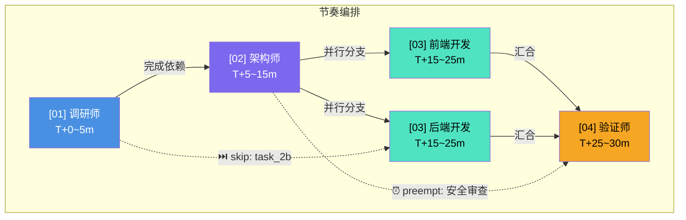

# 节奏图谱模板 (Rhythm Diagram Template)

> **版本**: V1.0
> **用途**: 可视化多Agent协作节奏流程

---

## 节奏图谱说明

节奏图谱用于可视化任务执行流程中的Agent调度、时序、依赖关系。

### 图谱元素

| 元素 | 符号 | 说明 |
|------|------|------|
| Agent节点 | `[01]` `[02]` `[03]` | Agent标识 |
| 任务节点 | `(task_1)` `(task_2)` | 任务单元 |
| 并行流 | →→ | 并行执行 |
| 串行流 | ──▶ | 串行依赖 |
| 跳过 | ⏭️ | 跳过执行 |
| 插队 | ⏰ | 优先级提升 |
| 暂停 | ⏸️ | 暂停执行 |

---

## 节奏图谱模板

```yaml
rhythm_diagram:
  version: "1.0"
  created: "YYYY-MM-DD"
  task_id: "TASK-XXX"
  task_name: "任务名称"

  # ===== 时间轴 =====
  timeline:
    unit: "分钟"
    total_duration: "30m"
    start_time: "T+0"
    end_time: "T+30"

  # ===== Agent节点 =====
  agents:
    - id: "01"
      name: "调研师"
      color: "#4A90E2"
      position: "left"

    - id: "02"
      name: "架构师"
      color: "#7B68EE"
      position: "center-left"

    - id: "03"
      name: "构建师"
      color: "#50E3C2"
      position: "center"

    - id: "04"
      name: "验证师"
      color: "#F5A623"
      position: "center-right"

    - id: "05"
      name: "安全师"
      color: "#E74C3C"
      position: "right"

    - id: "06"
      name: "审查师"
      color: "#9013FE"
      position: "right"

  # ===== 任务节点 =====
  tasks:
    - id: "task_1"
      name: "需求分析"
      agent_id: "01"
      duration: "5m"
      start: "T+0"
      end: "T+5"
      type: "normal"

    - id: "task_2"
      name: "架构设计"
      agent_id: "02"
      duration: "10m"
      start: "T+5"
      end: "T+15"
      type: "normal"
      depends_on: ["task_1"]

    - id: "task_3a"
      name: "前端开发"
      agent_id: "03"
      duration: "10m"
      start: "T+15"
      end: "T+25"
      type: "parallel"
      depends_on: ["task_2"]

    - id: "task_3b"
      name: "后端开发"
      agent_id: "03"
      duration: "10m"
      start: "T+15"
      end: "T+25"
      type: "parallel"
      depends_on: ["task_2"]

    - id: "task_4"
      name: "集成测试"
      agent_id: "04"
      duration: "5m"
      start: "T+25"
      end: "T+30"
      type: "normal"
      depends_on: ["task_3a", "task_3b"]

  # ===== 特殊事件 =====
  events:
    - time: "T+10"
      type: "skip"
      description: "task_2b被跳过（trivial_skip）"
      task_id: "task_2b"

    - time: "T+8"
      type: "preempt"
      description: "安全审查插队（security_preempt）"
      task_id: "task_2a"
      priority: "high"

    - time: "T+20"
      type: "pause"
      description: "等待外部依赖（resource_contention）"
      duration: "3m"
      affected_tasks: ["task_3a"]

  # ===== 可视化布局 =====
  layout:
    type: "swimlane"  # swimlane / timeline / gantt
    orientation: "horizontal"
    show_dependencies: true
    show_time_markers: true
    grid_enabled: true
```

---

## Mermaid流程图格式



---

## 节奏图谱渲染配置

```yaml
rendering:
  format: "mermaid"  # mermaid / ascii / svg / png
  theme: "neutral"

  mermaid:
    diagram_type: "graph TD"
    add_timestamp: true
    add_legend: true

  ascii:
    box_chars: "unicode"
    width: 80

  colors:
    agent_01: "#4A90E2"
    agent_02: "#7B68EE"
    agent_03: "#50E3C2"
    agent_04: "#F5A623"
    agent_05: "#E74C3C"
    agent_06: "#9013FE"
    skip: "#95A5A6"
    preempt: "#E74C3C"
    pause: "#F39C12"
```

---

## 节奏图谱示例：标准Web开发任务

```yaml
example_standard_web_dev:
  task_name: "Web应用开发"
  total_agents: 4
  total_duration: "45m"

  flow:
    - phase: "调研"
      agent: "01"
      duration: "5m"
      description: "需求分析和竞品调研"

    - phase: "设计"
      agent: "02"
      duration: "10m"
      description: "系统架构和API设计"
      depends_on: ["调研"]

    - phase: "开发"
      agents: ["03", "03"]
      duration: "20m"
      type: "parallel"
      branches:
        - name: "前端"
          tasks: ["登录页", "仪表盘", "列表页"]
        - name: "后端"
          tasks: ["认证API", "数据API", "业务逻辑"]
      depends_on: ["设计"]

    - phase: "测试"
      agent: "04"
      duration: "8m"
      description: "功能测试和集成测试"
      depends_on: ["开发"]

    - phase: "发布"
      agent: "08"
      duration: "2m"
      description: "灰度发布和监控"
      depends_on: ["测试"]

  special_events:
    - type: "skip"
      phase: "开发"
      branch: "前端"
      task: "管理后台"
      reason: "redundancy_skip: MVP阶段非必需"

    - type: "preempt"
      phase: "测试"
      task: "安全扫描"
      reason: "security_preempt: 支付模块高风险"

    - type: "pause"
      phase: "开发"
      reason: "backpressure: 第三方API限流"
      duration: "2m"
```

---

## 版本历史

```yaml
versions:
  - version: "1.0.0"
    date: "YYYY-MM-DD"
    author: "天龙引擎"
    changes:
      - "初始版本"
```
